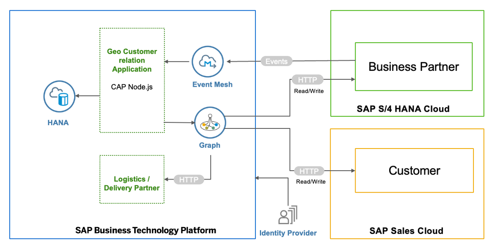

# Build an Extension Application Using SAP Graph and SAP Event Mesh

> Note: The content of this GitHub repository has been created as a source for the SAP Discovery Center Mission [Build an Extension Application Using SAP Graph and SAP Event Mesh](https://discovery-center.cloud.sap/missiondetail/3702/3745/). We recommend that you use the mission directly in SAP Discovery Center.

## Description

Extend SAP S/4HANA Cloud on SAP Business Technology Platform (SAP BTP) using state-of-the-art methodologies and technologies. Put an event-driven architecture into action, use the SAP Cloud Application Programming Model (CAP) for building on SAP S/4HANA Cloud events, and use SAP Graph to consume unified APIs to retrieve all the required information.

The main intent of this scenario is to complement an existing business process in an SAP solution, which means, enhancing SAP S/4HANA Cloud and SAP Sales Cloud with additional business process steps. This involves adding major logic and/or additional data and goes beyond simple UI changes.

## Business Scenario

As a call centre employee of a premium beverage company called Icy Cool, John would like to get alerted when new retailer is onboarded as a customer in his region (for example, Canada) and view the customer address details. 

John would then proceed to call the customer, understand specific requirements, followed by:
- Identifying and assigning the sales employee to the account team (in SAP Sales Cloud)
- Adding delivery unloading point (in SAP S/4HANA Cloud)
- Updating the status of the customer (in an extension application)
- Track the shipment/delivery status of the Welcome-kit and regular shipments from Logistics Partner (custom API extension for third-party API)

Through this extension application, the beverage company ensures that the call centre employee can set up the desired master data in two SAP systems.

**Current Position - What is the challenge?**

- Business Partner data available only in SAP S/4HANA Cloud system
- Call center employees need access to SAP S/4HANA Cloud and SAP Sales Cloud for their work
- No custom UI for specific geo marketing use case

**Destination - What is the outcome?**

- Changes in SAP S/4HANA Cloud communicated via events in real time to extension application
- Custom extension application works independently from SAP S/4HANA Cloud and SAP Sales cloud
- Call center employees only need access to the custom application

**Development Challenges**

Developing SAP extension applications that work with multiple SAP systems require mastering a broad set of skills for even the simplest data queries, and the applications you develop are sensitive to the smallest product and landscape configuration changes.

**Services and Components**

- SAP Graph
- SAP Event Mesh
- SAP BTP, Cloud Foundry runtime
- SAP HANA Cloud

## Solution Architecture

The extension application is developed using the CAP and runs on SAP BTP. It consumes platform services like SAP Event Mesh and SAP Graph. The events generated in SAP S/4HANA Cloud are inserted into an SAP Event Mesh queue created by CAP. The application consumes these events and inserts relevant business partners into the local database. The extensions application uses SAP Graph unified APIs to read Business Partner data from the SAP S/4HANA Cloud and SAP Sales Cloud systems and update the relevant details back to the source system.

## Focus Topics of the Mission

The tutorial focuses on the following aspects:

- Building a side-by-side extension to [SAP S/4HANA Cloud](https://help.sap.com/viewer/product/SAP_S4HANA_CLOUD/2111.501/en-US?task=discover_task)
- Setting up eventing and consuming events from SAP S/4HANA Cloud using [SAP Event Mesh](https://help.sap.com/viewer/product/SAP_EM/Cloud/en-US)
- Configuring custom extensions and consuming data via API calls using [SAP Graph](https://help.sap.com/viewer/84bbf6acb5384861add4cb6939bef647/PROD/en-US/af92ea0700ab4c59a3cfcd79158fdd56.html)
- Developing an application on [SAP BTP](https://help.sap.com/viewer/product/BTP/Cloud/en-US?task=discover_task) using [CAP](https://cap.cloud.sap/docs/)
- Implementing an [SAP Fiori elements](https://help.sap.com/viewer/product/SAP_FIORI_tools/Latest/en-US) UI

## Where to Start?

#### Step 1: [Prerequisites](./documentation/Prerequisites/README.md)

#### Step 2: [Set Up SAP BTP and SAP S/4HANA Cloud](./documentation/Set%20Up%20SAP%20BTP%20and%20SAP%20S/4HANA/README.md)

#### step 3: [Set Up SAP BTP and SAP Sales Cloud](./documentation/Set%20Up%20SAP%20BTP%20and%20SAP%20Sales%20Cloud/README.md)

#### Step 4: [Set Up Logistics Partner Application](./documentation/Set%20Up%20Logistics%20Partner%20app%20/README.md)
#### Step 5: [Set Up SAP Graph](./documentation/Set%20Up%20SAP%20Graph/README.md)

#### Step 6: [Install Geo Relations Application](./documentation/Install%20Application/README.md)

#### Step 7: [Configure and Run Geo Relations Application](./documentation/Configure%20and%20Run%20Application/README.md)

#### Step 8: [Run the Sample Scenario](./documentation/Execute%20Example%20Scenario/README.md)

#### Step 9: (Optional) [Set Up Mock Server](./documentation/Set%20Up%20Mock%20Server/README.md)

## Known Issues

The tutorial is provided on the "as-is" basis. Currently, there are no known issues for the tutorial project.

## How to Obtain Support

Create an issue to get support or to report a bug in [GitHub](https://github.com/SAP-samples/cloud-extension-graph-sample/issues).

## License

Copyright (c) 2022 SAP SE or an SAP affiliate company. All rights reserved. This project is licensed under the Apache Software License, version 2.0 except as noted otherwise in the [LICENSE](LICENSES/Apache-2.0.txt) file.
