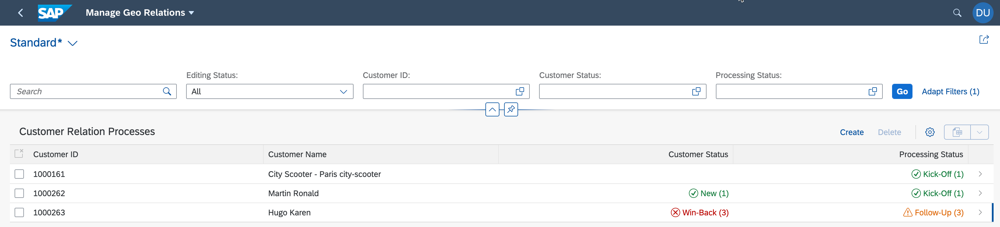
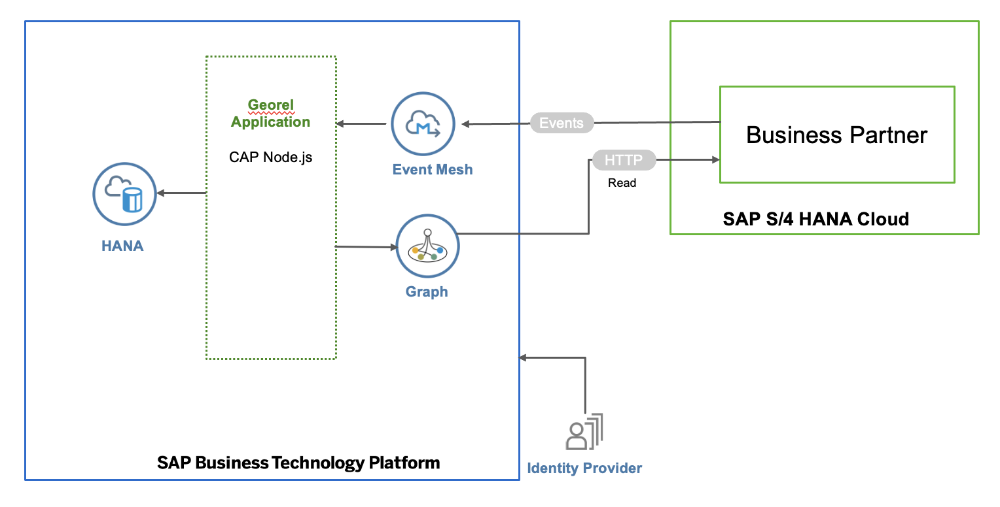

# Build an Extension Application Using SAP Graph and SAP Event Mesh

> Note: The content of this GitHub repository has been created as source for the SAP Discovery Center Mission [Build an Extension Application Using SAP Graph and SAP Event Mesh](https://discovery-center.cloud.sap/missiondetail/3702/3745/). We recommend using directly the mission in the SAP Discovery Center.

## Description

Extend SAP S/4HANA Cloud on the SAP Business Technology Platform (SAP BTP) using state-of-the-art methodologies and technologies. Put an event-driven architecture into action, use the SAP Cloud Application Programming Model (CAP) for building on SAP S/4HANA Cloud events, and use SAP Graph to consume unified APIs to retrieve all the required information.

The main intent of this scenario is to complement an existing business process in an SAP solution, which means, enhancing SAP S/4HANA Cloud with additional business process steps. This involves adding major logic and/or additional data and goes beyond simple UI changes.

## Business Scenario

In specific focus regions, we would like to follow up with newly created customers or existing customers that have had their data updated in our SAP S/4HANA Cloud backend. External call center employees should do this follow-up for us by contacting relevant customers by phone. At the same time, the call center employees have no access to our SAP S/4HANA system. We, therefore, provide a custom-built extension application that is designed and optimized for the task and that is supplied with relevant data in real time using an event-driven approach.

**Current Position - What is the challenge?**

- Business Partner data available only in SAP S/4HANA system
- Call center employees need access to SAP S/4HANA for their work
- No custom UI for specific geo marketing use case

**Destination - What is the outcome?**

- Changes in SAP S/4HANA Cloud communicated via events in real time to extension application
- Custom extension application works independently from SAP S/4HANA
- Call center employees only need access to custom app

**Development Challenges**

- Developing SAP extension apps that work with multiple SAP systems require mastering a broad set of skills for even the simplest data queries, and the applications you develop are sensitive to the smallest product and landscape configuration changes.

**Solution**

- SAP Graph

## Architecture

### Solution Diagram

The extension application is developed using the CAP and runs on the SAP BTP. It consumes platform services like SAP Event Mesh and SAP Graph services. The events generated in SAP S/4HANA Cloud are inserted into an SAP Event Mesh queue created by CAP. The application consumes these events and inserts relevant business partners into the local database. The extensions application uses SAP Graph APIs to read Business Partner data from the SAP S/4HANA Cloud system.

## Focus Topics of the Mission

The tutorial focus on the following aspects:

- Building a side-by-side extension to [SAP S/4HANA Cloud](https://help.sap.com/viewer/product/SAP_S4HANA_CLOUD/2111.501/en-US?task=discover_task)
- Setting up Eventing and consuming events from SAP S/4HANA Cloud using [SAP Event Mesh](https://help.sap.com/viewer/product/SAP_EM/Cloud/en-US)
- Consuming data via API calls using [SAP Graph](https://help.sap.com/viewer/84bbf6acb5384861add4cb6939bef647/Beta/en-US)
- Developing an application on [SAP BTP](https://help.sap.com/viewer/product/BTP/Cloud/en-US?task=discover_task) using [CAP](https://cap.cloud.sap/docs/)
- Implementing an [SAP Fiori elements](https://help.sap.com/viewer/product/SAP_FIORI_tools/Latest/en-US) UI

## Where to Start?

#### Step 1: [Prerequisites](./documentation/Prerequisites/README.md)

#### Step 2: [Set Up Connectivity and Extensibility](./documentation/Set%20Up%20SAP%20BTP%20and%20S4HANA/README.md)

#### Step 3: [Set Up SAP Graph](./documentation/Set%20Up%20SAP%20Graph/README.md)

#### Step 4: [Install Geo Relations Application](./documentation/Install%20Application/README.md)

#### Step 5: [Configure and Run Application](./documentation/Configure%20and%20Run%20Application/README.md)

#### Step 6: [Execute Example Scenario](./documentation/Execute%20Example%20Scenario/README.md)

## Known Issues

The tutorial is provided on the "as-is" basis. Currently, there are no known issues for the tutorial project.

## How to Obtain Support

Create an issue to get support or to report a bug [here](https://github.com/SAP-samples/cloud-extension-graph-sample/issues).

## License

Copyright (c) 2021 SAP SE or an SAP affiliate company. All rights reserved. This project is licensed under the Apache Software License, version 2.0 except as noted otherwise in the [LICENSE](LICENSES/Apache-2.0.txt) file.
