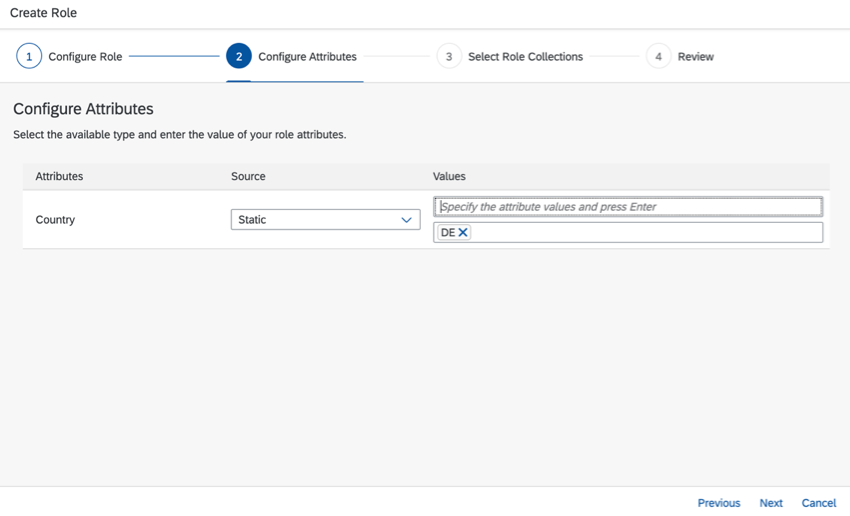

# Configure and Run Application

With the app coding ready, you now need to perform a few steps to adjust the app to your own environment.
In detail, you have to adapt the *manifest.yaml* and the *service.js* files.

Find the *manifest.yaml* and *services-manifest.yml* files in your installation folder and open it. Perform the following adjustments, if at all needed. Adjustments are only needed if you have adjusted the services names during the earlier steps or plan for using an app name without the random route option with the push command later.

  In case you are wondering about the correct service names, you can look then up the [SAP BTP Cockpit](https://account.hana.ondemand.com/).

 

# Deployment

We are going to use the Cloud Foundry Command Line Interface (CLI) for the deployment. In case you have not installed it yet please do it as mentioned in the [Prerequisites](../Prerequisites/README.md).

Deployment can be done either using a manifest file or [MTA](https://help.sap.com/products/BTP/65de2977205c403bbc107264b8eccf4b/d04fc0e2ad894545aebfd7126384307c.html?locale=en-US) file. You can choose from the two following options:

### Deploy the Application using Manifest Files 

1. Open a command line window.

2. Log in to the account and space:

```
cf login -sso
```

or alternatively log in to the account and space using your SAP BTP credentials:

```
cf login
```

3. Ensure you are in the folder that contains the *manifest.yaml* file.

4. Execute the following command, using [CF service push plugin](https://github.com/dawu415/CF-CLI-Create-Service-Push-Plugin):

```
cf create-service-push --vars-file vars-dev.yml --push-as-subprocess
```
  In case Create-Service-Push plugin is missing, execute the following command to install it.

```
cf install-plugin -r CF-Community "Create-Service-Push"
```

### Deploy the Application using MTA

The deployment is based on MTA (*Multi-Target Application*, sometimes also called *MultiApps*) technology. The [MTA](https://help.sap.com/products/BTP/65de2977205c403bbc107264b8eccf4b/d04fc0e2ad894545aebfd7126384307c.html?locale=en-US) is a SAP-proprietary way to do deployments consisting of multiple modules that can be implemented in different technologies.

#### Prerequisites

Follow steps 1-4 in [tutorial](https://developers.sap.com/tutorials/btp-app-cap-mta-deployment.html)

#### Build the Application

1. Build the MTA module:

```
mbt build
```

This creates a `mtar` file `<xxx.mtar>` in the current folder.

#### Deploy the Application:

1. Deploy the module to your current Cloud Foundry space:

```
cf deploy -f <path/to/mtar>
```

2. The deployment can take some minutes. After successful deployment, check if all the services have been created:

```
cf services
```

3. In the deploy log, find the URL of your deployed app.

Example URL: *geo.cfapps.us10.hana.ondemand.com*

> Using the command `CF apps` you can always look up this information.

4. Replace `geo` with the host name, which was entered in the *manifest.yaml* file.

5. Open the URL of your deployed app in a browser. Choose the hyperlink `/geo-customer/webapp/index.html`.

  


# Create a Role

After the application was deployed, you will see two **Role Templates** in [SAP BTP cockpit](https://account.hana.ondemand.com/).

  

Now, we need to create a new role using role template 'Viewer'.

1. Go to **Roles**.

2. Add new role by choosing **+**.

3. Configure role attributes. As **Role Template** choose **Viewer**.

  

4. Choose **Next**.

5. Specify the **Country** attribute of your choice.

  

6. Choose **Next**.

7. Select the role collection of your preference with *&#x2611;*.

  

8. Choose **Next**.

9. Review the role.

10. Choose **Finish**.

11. Ensure that the chosen role collection is assigned to the application's user.
