# Execute Example Scenario

The scenario shows the creation of a new Business Partner in the SAP S/4HANA system.

## Creation of a Business Partner in SAP S/4HANA Cloud

A new Business Partner is created in the SAP S/4HANA system. For it to be shown in the app, the Business Partner must be located in the U.S. and have role *FLCU01* assigned.

On top, the following properties of the business partner should be filled as well:

- FirstName
- LastName
- correspondanceLanguage
- City
- PhoneNumber
- MailAddress

After the creation of the Business Partner, a *BusinessPartner.created* event is fired that the app receives. As a payload the event contains the Business Partner ID. In a next step, the app calls the appropriate OData service on the SAP S/4HANA Cloud system, to obtain more information on the Business Partner.

Then the app checks if the Business Partner is located in the U.S. and has role *FLCU01*. If yes, the app creates an entry in the database. This entry contains the additional information on the Business Partner. All of this happens in the background without the user noticing.

At this point, the application’s user interface needs to be manually refreshed to see the new entry in the list. Clicking on the entry allows you to view the details, including technical information and URL of the specific Business Partner in the backend.
On the details page, there’s an *Edit* button, which allows to switch to edit-mode. Fields for which the data retrieved from the backend are read-only. Additionally, there are two fields `Account Team Responsible` and `Delivery Unloading Point`. You can choose `Account Team Responsible` from the list of employees data available in SAP Sales Cloud system. After pressing save, the entries of these fields are saved to the respective backend systems.
After customer care activities, the user of the app can change the customer status and processing status and these changes are stored in the database. The app automatically stores a draft of changes. After pressing save, the changes are written to the database.

## Demo Script

1. In the command line window check if the app is running:

```
cf apps
```

2. Find the URL for the "geo-customer-ui" app - this is the launch URL for the Geo Relations application.

3. Open the URL in a browser.

4. Choose the tile for Geo Relations app.

    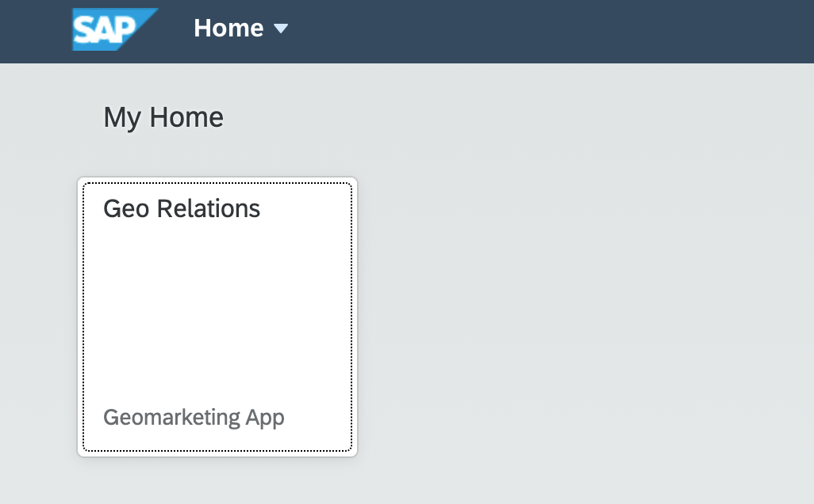

5. The list of **Customer Relation Processes** along with their **Customer Status** gets displayed.

    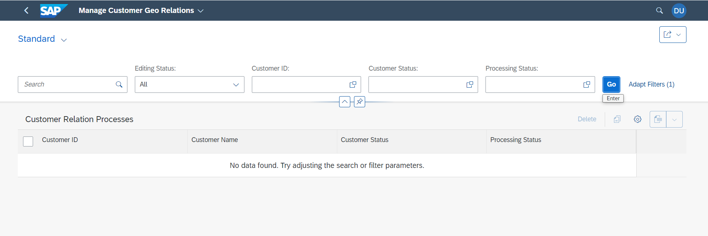

6. Log in to the SAP S/4HANA Cloud system.

7. Navigate to the *Manage Business partner Master Data* transaction.

8. Create a Business Partner/Customer of type *Organization* with location DE(whichever country was specified in role) and role *FLCU01*. Provide language, address, email, and phone number as well for the customer.

    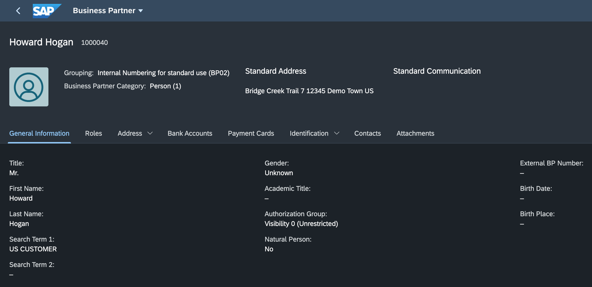

9. Now, go back to the Geo Relations application to see if the new Business Partner has been updated in the UI.

 *Troubleshoot* : If BP is not reflecting on the Geo Relations application, remove and add the Outbound Topic binding again as described in the chapter [Set Up SAP BTP and SAP S4HANA Cloud](https://github.com/SAP-samples/cloud-extension-graph-sample/blob/main/documentation/Set%20Up%20SAP%20BTP%20and%20SAP%20S/4HANA/README.md).
 
10. Go to the details page for the new Business Partner. Choose **Edit**.

    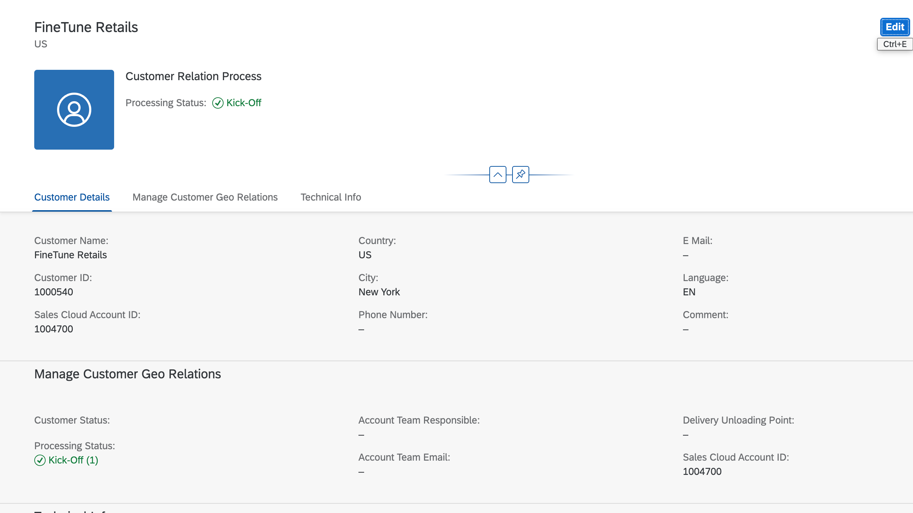

11. Add Account Team responsible for the Business Partner from the Sales Cloud system:

    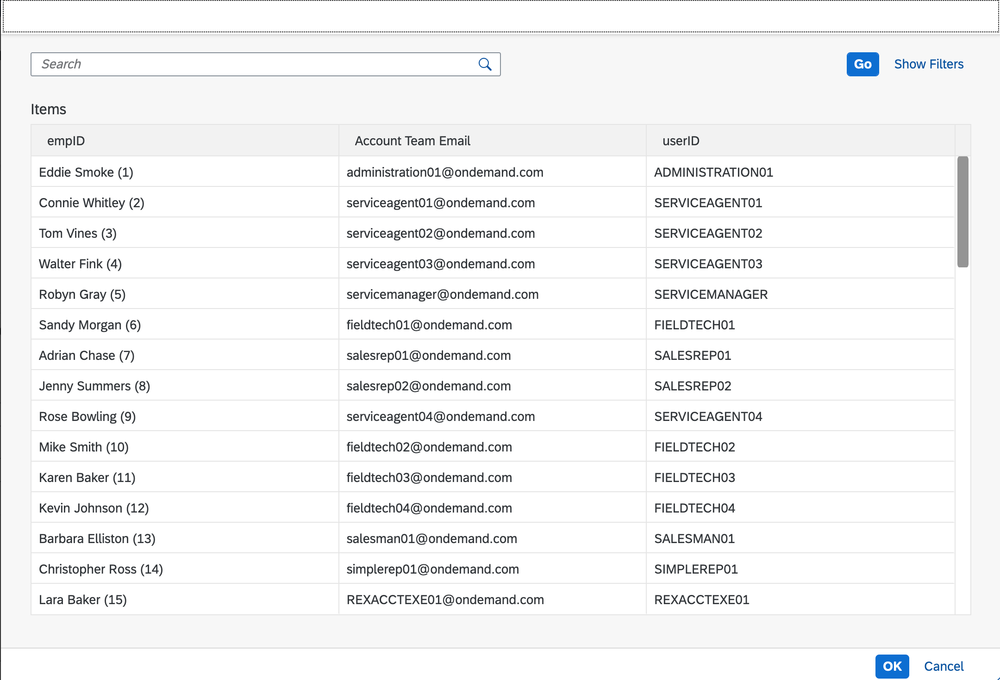

12. Fill the Delivery Unloading point:

    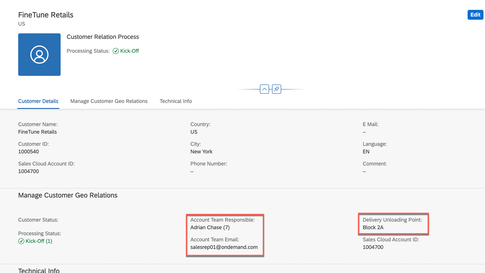

13. Notice that the changes reflected back to the Business Partner in the SAP S/4HANA Cloud and SAP Sales Cloud system.

    In SAP S/4HANA Cloud system:
    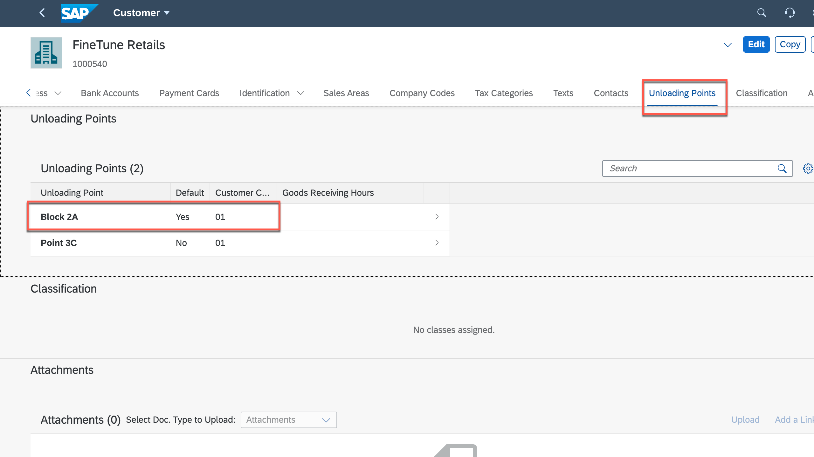

    In SAP Sales Cloud system:
    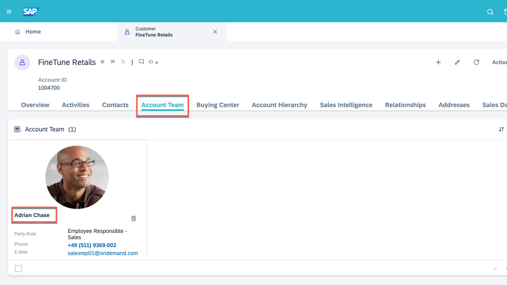

14. Open `Logistics Information` section and notice the shipment details

    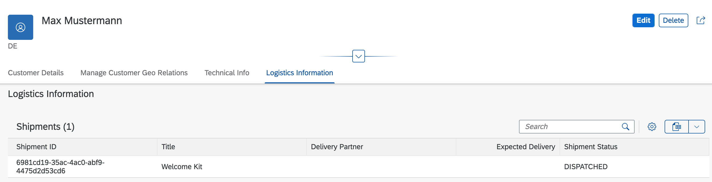

    In the next step, lets add the `Delivery Partner`, `Expected Delievery` and `Shipment Status` in the Logistics partner application to see whether the changes reflect in the Geo Customer relation application.

15. Open the `Logistics Partner` application that we deployed in the [earlier](../Set%20Up%20Logistics%20Partner%20app%20/README.md) chapter.

    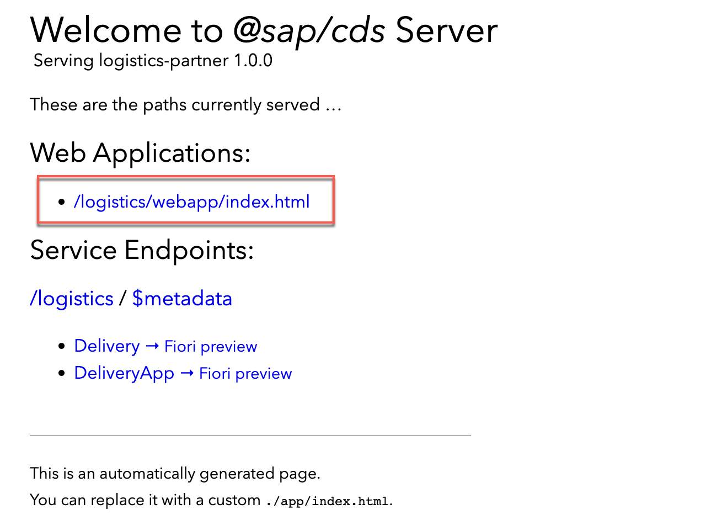

    Open the web application

16. Find the `customerId` in the list and go to the details page

    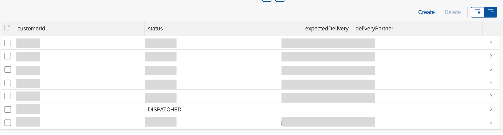

17. Edit the information and add/change the fields

    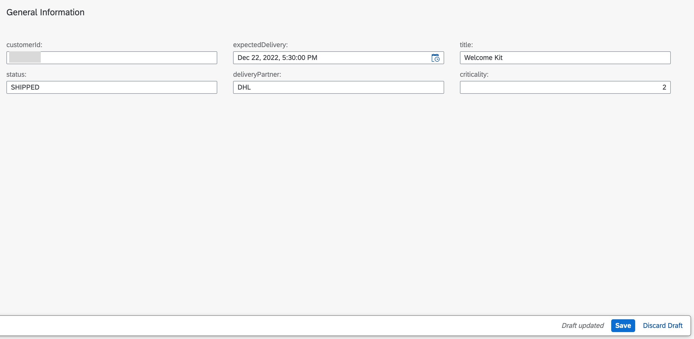

    save the details.

18. Refresh the Geo customer relation application to see the latest updates.

    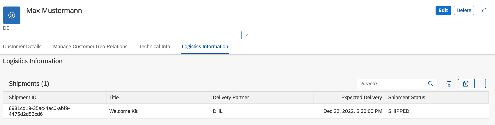
       
19. Check out the options that the Geo Relations app offers like changing a status.

20. Play around with the app.


