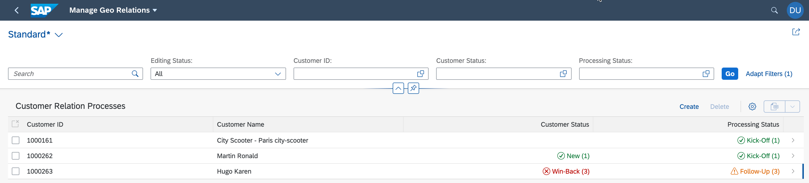

# Install Geo Relations Application

The app allows you to maintain customer relations for a specific region. Currently, "US" is the default, which can be adapted via environment variables.

From a technology perspective, the application is written in JavaScript and running on Node.js. It comes with an embedded SQLite database and new database content is stored in a local file on the cloud.

 


You can either clone the code from GitHub or download and extract the ZIP file provided to your local file system in <your installation folder>.

1. Clone the project:

```
git clone https://github.com/SAP-samples/cloud-extension-graph-sample.git
```

2. Navigate to the folder of your application in which the `package.json` is located, which should be <your installation folder>/cloud-extension-graph-sample.

3. Before you continue, make sure that you’ve completed the prerequisites and installed SQLite tools (for Windows users only). Run the following three commands:

```
npm install

npm install @cap-js/sqlite 
```

> In case of issues or errors, make sure that your Node installation is up to date. Specifically in case of issues installing @cap-js/sqlite packages on Windows you could try:

```
npm install -g npm@latest

npm install @cap-js/sqlite -g npm@latest
```


