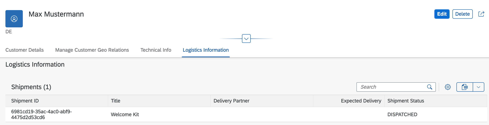
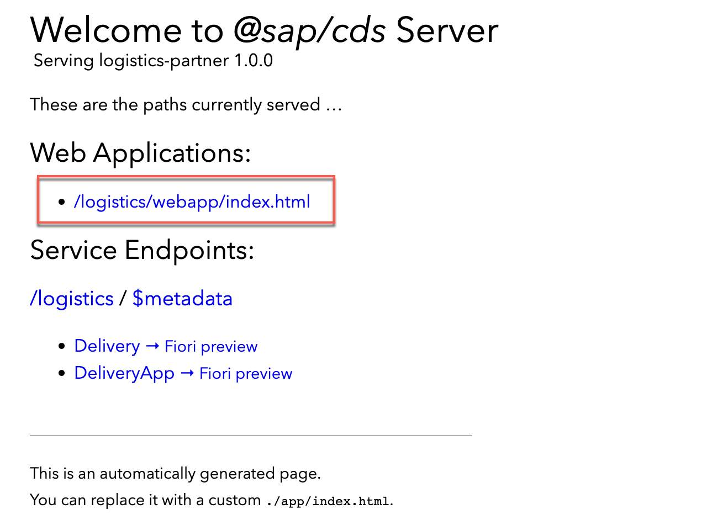
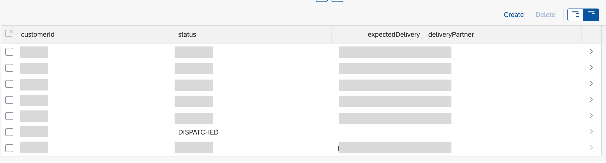
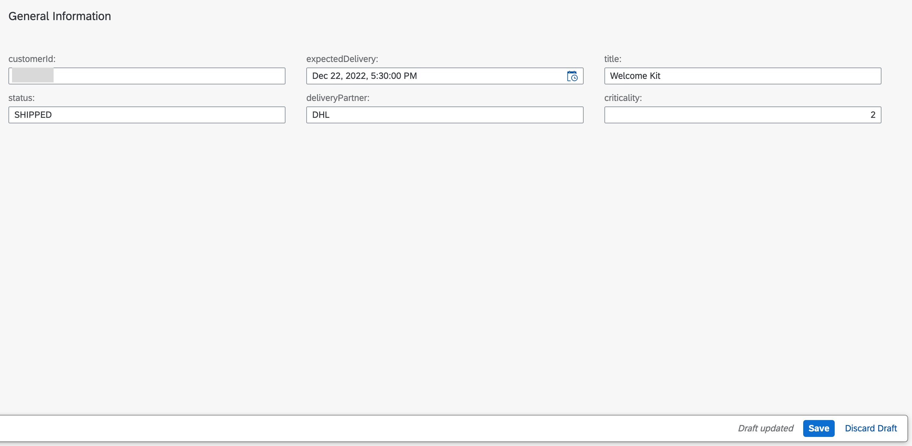
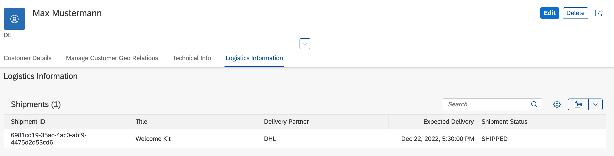

# Set Up Mock Server

**Note:** If you have already set up the SAP S/4HANA Cloud and SAP Sales Cloud system, you can skip this section.

## Clone the Mock Server

Clone the mock server application from [GitHub](https://github.com/SAP-samples/cloud-extension-ecc-business-process) using the branch `mock`:

```
git clone https://github.com/SAP-samples/cloud-extension-ecc-business-process -b mock
```

## Deployment

You will use the Cloud Foundry Command Line Interface (cf CLI) for the deployment. In case you have not installed it yet, follow the steps described in [GitHub](https://github.com/cloudfoundry/cli#downloads).

To deploy the application, perform the following steps:

1. Open command prompt.

2. Log in to the account and space:

```
cf login -sso
```

    Alternatively, run this command:

```
cf login
```

3. Navigate to the folder `Mock application folder` that you have cloned from the GitHub in the previous step.

### Deploy the Application Using MTA

#### Set Up the MultiApps CF CLI Plugin

> If you are using SAP Business Application Studio, skip the following steps. 

1. To build the multitarget application, you need to [download](https://sap.github.io/cloud-mta-build-tool/download/) the [Cloud MTA Build Tool (MBT)](https://sap.github.io/cloud-mta-build-tool/).

2. For Windows, install [MAKE](https://www.gnu.org/software/make/).

3. To install the [MultiApps CF CLI Plugin](https://github.com/cloudfoundry-incubator/multiapps-cli-plugin), run the following command: 

`cf install-plugin multiapps`

4. To install the Cloud MTA Build Tool, run the following command: 

`npm install -g mbt`


#### Build Application

To build the application, run this command: 

```
mbt build
```

#### Deploy Application

To deploy the application, run this command: 

```
cf deploy <path/to/mtar>
```

### Bind SAP Event Mesh Service Instance

To receive the events in the SAP Event Mesh queue, bind the same Georel application SAP Event Mesh instance to the mock server.

Run the following command from the terminal:

`cf bs mock-srv georel-graph-em && cf restart mock-srv`

### Set Up the Destination in the SAP BTP Cockpit

You need to configure two destinations for your SAP Sales Cloud system mock and the SAP S/4HANA Cloud system mock, which would be used for the SAP Graph configuration in the next steps.

1. Open the SAP BTP cockpit, go to your global account and navigate to your subaccount.

2. Choose **Connectivity** in the left-hand navigation, and then choose **Destinations** &rarr; **New Destination**.

3. Enter the following information for the first destination in the **Destination Configuration** section and save your input:

    - Name: `graph-c4c-dest`
    - URL: `https://<mock_srv_url>/v2/odata/v4/c4codata`
    - Authentication: `No Authentication`

4. Again, choose **Destinations** &rarr; **New Destination** and enter the following information for the second destination and save your input:

    - Name: `bupa`
    - URL: `https://<mock_srv_url>/v2/odata/v4/api-business-partner`
    - Authentication: `No Authentication`

### Adjust the Configuration in SAP Graph

Adjust the configuration in SAP Graph in [Step 3](../Set%20Up%20SAP%20Graph/README.md#sap-graph-configuration).

Remove the `path` parameter from the graph configuration and also adjust the destination names provided for the mock APIs in the previous step.

### Demo Script

1. In the command line interface, run the command `cf apps`.

2. Find the URL for the Geo Relations app (`geo-customer-ui`). This is the launch URL for the Geo Relations application.

3. Open the URL in a browser.

4. Choose the tile for **Geo Relations** application.


5. The list of **Customer Relation Processes** along with their status gets displayed.


6. Create a new customer in the mock server using business partner API:

```
POST https://<mock_srv_url>/v2/odata/v4/api-business-partner/A_BusinessPartner

{
    "BusinessPartner": "25555",
    "BusinessPartnerFullName": "Max Mustermann",
    "FirstName": "Max",
    "LastName": "Mustermann",
    "BusinessPartnerIsBlocked": true,
    "Language": "EN",
    "to_BusinessPartnerAddress": [
        {
            "BusinessPartner": "25555",
            "AddressID": "1",
            "StreetName": "Platz der Republik",
            "HouseNumber": "1",
            "PostalCode": "10557",
            "CityName": "Berlin",
            "Country": "DE",
            "Language": "EN"
        }
    ],
    "to_Customer": {
        "Customer": "25555"
    }
}
```

7. Now, go back to the Geo Relations application to see if the new Business Partner has been updated in the UI.

8. Go to the details page for the new Business Partner. Choose **Edit**.


9. Add Account Team responsible for the Business Partner from the SAP Sales Cloud system.

    

10. Fill the Delivery Unloading point.

    

11. Notice that the changes reflected back to the Business Partner using the SAP S/4HANA Cloud and SAP Sales Cloud API in the mock server.

Delivery Unloading Point:

```
GET https://<mock_srv_url>/v2/odata/v4/api-business-partner/A_Customer('25555')/to_CustomerUnloadingPoint

```

Account Team:

```

GET https://<mock_srv_url>/v2/odata/v4/c4codata/CorporateAccountCollection('<OBJECT_ID>')/CorporateAccountTeam

```

Replace `mock_srv_url` and `OBJECT_ID` accordingly.

12. Open `Logistics Information` section and notice the shipment details.

    

    In the next step, lets add the **Delivery Partner**, **Expected Delievery** and **Shipment Status** in the Logistics partner application to see whether the changes reflect in the Geo Customer relation application.

13. Open the `Logistics Partner` application that we deployed in the [earlier](../Set%20Up%20Logistics%20Partner%20app%20/README.md) chapter.

    

    Open the web application.

14. Find the `customerId` in the list and go to the details page.

    

15. Edit the information and add/change the fields.

    

    Save the changes.

16. Refresh the Geo customer relation application to see the latest updates.

    

17. Check out the options that the Geo Relations app offers like changing a status.

18. Play around with the application.
