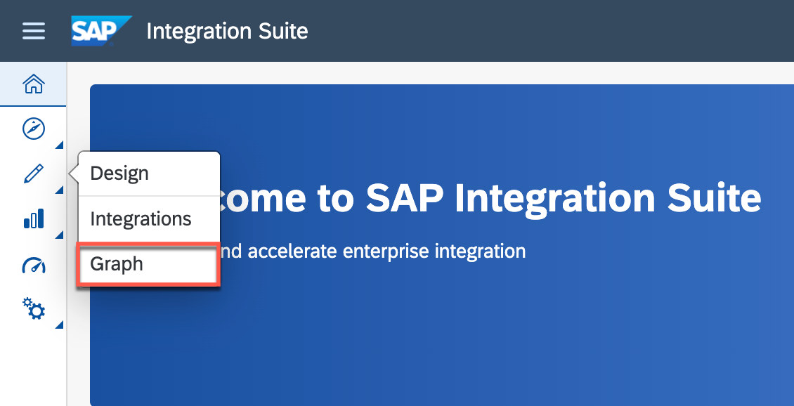

# Set Up Mock Server

**Note:** If you have already set up the SAP S/4HANA Cloud and SAP Sales Cloud system, you can skip this section.

## Clone the Mock Server

Clone the mock server application from [GitHub](https://github.com/SAP-samples/cloud-extension-ecc-business-process) using the branch `mock`:

```
git clone https://github.com/SAP-samples/cloud-extension-ecc-business-process -b mock
```

## Deployment

You will use the Cloud Foundry Command Line Interface (cf CLI) for the deployment. In case you have not installed it yet, follow the steps described in [GitHub](https://github.com/cloudfoundry/cli#downloads).

To deploy the application, perform the following steps:

1. Open command prompt.

2. Log in to the account and space:

```
cf login -sso
```

    Alternatively, run this command:

```
cf login
```

3. Navigate to the folder `Mock application folder` that you have cloned from the GitHub in the previous step.

### Deploy the Application Using MTA

#### Set Up the MultiApps CF CLI Plugin

> If you are using SAP Business Application Studio, skip the following steps. 

1. To build the multitarget application, you need to [download](https://sap.github.io/cloud-mta-build-tool/download/) the [Cloud MTA Build Tool (MBT)](https://sap.github.io/cloud-mta-build-tool/).

2. For Windows, install [MAKE](https://www.gnu.org/software/make/).

3. To install the [MultiApps CF CLI Plugin](https://github.com/cloudfoundry-incubator/multiapps-cli-plugin), run the following command: 

`cf install-plugin multiapps`

4. To install the Cloud MTA Build Tool, run the following command: 

`npm install -g mbt`


#### Build Application

To build the application, run this command: 

```
mbt build
```

#### Deploy Application

To deploy the application, run this command: 

```
cf deploy <path/to/mtar>
```

### Bind SAP Event Mesh Service Instance

To receive the events in the SAP Event Mesh queue, bind the same Georel application SAP Event Mesh instance to the mock server.

Run the following command from the terminal:

`cf bs mock-srv georel-graph-em && cf restart mock-srv`

### Set Up the Destination in the SAP BTP Cockpit

You need to configure two destinations for your SAP Sales Cloud system mock and the SAP S/4HANA Cloud system mock, which would be used for the SAP Graph configuration in the next steps.

1. Open the SAP BTP cockpit, go to your global account and navigate to your subaccount.

2. Choose **Connectivity** in the left-hand navigation, and then choose **Destinations** &rarr; **New Destination**.

3. Enter the following information for the first destination in the **Destination Configuration** section and save your input:

    - Name: `graph-c4c-dest`
    - URL: `https://<mock_srv_url>/odata/v2/c4codata`
    - Authentication: `No Authentication`

4. Again, choose **Destinations** &rarr; **New Destination** and enter the following information for the second destination and save your input:

    - Name: `bupa`
    - URL: `https://<mock_srv_url>/odata/v2/api-business-partner`
    - Authentication: `No Authentication`

## Set Up Graph

### Configure Model Extension

1. Select **Graph** under **Design Artifacts** in the left-side menu of the SAP Integration Suite interface.

<!--  -->


2. Choose **Model Extensions** tab and click on **create from file**.

<!--  -->


3. Give the name **Logistics Partner** and upload the file [Logistics.custom.json](../../logistics-partner/config/Logistics.custom.json) from the config folder.

<!--  -->


4. Click on **Create**.

Logistics Partner model extension was created successfully and can now be used in a business data graph.

### Create a Business Data Graph

1. Select **Graph** under **Design Artifacts** in the left-side menu of the SAP Integration Suite interface.


2. Select **Create new business data graph** in the panel.


3. Provide an **ID** for the business data Graph as `v1`. Click **Next**.


4. Select the data sources to include in the business data graph. These are the destinations you previously configured in the SAP BTP cockpit.

  - bupa
  - graph-c4c-dest
  - logistics-partner


Select **Next**

5. Choose the configured **Model extension** `Logistics Partner` and select **Next**

6. Once the draft busines data gets generated, review the configuration.

7. Add the following Key mappings in the locating policy.

```json
"keyMapping": [
            {
                "foreignKey": {
                    "attributes": [
                        "ExternalID"
                    ],
                    "dataSource": "c4c",
                    "entityName": "sap.c4c.CorporateAccountCollection"
                },
                "references": {
                    "attributes": [
                        "BusinessPartner"
                    ],
                    "dataSource": "s4",
                    "entityName": "sap.s4.A_BusinessPartner"
                }
            },
            {
                "foreignKey": {
                    "attributes": [
                        "ExternalID"
                    ],
                    "dataSource": "c4c",
                    "entityName": "sap.c4c.IndividualCustomerCollection"
                },
                "references": {
                    "attributes": [
                        "BusinessPartner"
                    ],
                    "dataSource": "s4",
                    "entityName": "sap.s4.A_BusinessPartner"
                }
            }
        ]
```
**Note** : Kinldy remove the "c4c" from  locatingPolicy/rules/name:"sap.graph.*"/local

After adding and removing, full configuration should look like this

```json
{
    "businessDataGraphIdentifier": "v1",
    "description": "This business data graph includes APIs of SAP S/4HANA Cloud and SAP Sales Cloud",
    "graphModelVersion": "^v3",
    "schemaVersion": "1.2.0",
    "extensions": [
        "Logistics Partner"
    ],
    "dataSources": [
        {
            "name": "s4",
            "services": [
                {
                    "destinationName": "bupa"
                }
            ]
        },
        {
            "name": "c4c",
            "services": [
                {
                    "destinationName": "graph-c4c-dest"
                }
            ]
        },
        {
            "name": "my.custom",
            "services": [
                {
                    "destinationName": "logistics-partner"
                }
            ],
            "namespace": "my.custom"
        }
    ],
    "locatingPolicy": {
        "cues": [],
        "keyMapping": [
            {
                "foreignKey": {
                    "attributes": [
                        "ExternalID"
                    ],
                    "dataSource": "c4c",
                    "entityName": "sap.c4c.CorporateAccountCollection"
                },
                "references": {
                    "attributes": [
                        "BusinessPartner"
                    ],
                    "dataSource": "s4",
                    "entityName": "sap.s4.A_BusinessPartner"
                }
            },
            {
                "foreignKey": {
                    "attributes": [
                        "ExternalID"
                    ],
                    "dataSource": "c4c",
                    "entityName": "sap.c4c.IndividualCustomerCollection"
                },
                "references": {
                    "attributes": [
                        "BusinessPartner"
                    ],
                    "dataSource": "s4",
                    "entityName": "sap.s4.A_BusinessPartner"
                }
            }
        ],
        "rules": [
            {
                "name": "sap.s4.*",
                "leading": "s4",
                "local": []
            },
            {
                "name": "sap.c4c.*",
                "leading": "c4c",
                "local": []
            },
            {
                "name": "sap.graph.*",
                "leading": "s4",
                "local": [
                   
                ]
            },
            {
                "name": "sap.graph.AppointmentActivity",
                "leading": "c4c"
            },
            {
                "name": "sap.graph.BusinessUser",
                "leading": "c4c"
            },
            {
                "name": "sap.graph.ClassificationCharacteristic",
                "leading": "c4c"
            },
            {
                "name": "sap.graph.ClassificationClass",
                "leading": "c4c"
            },
            {
                "name": "sap.graph.Company",
                "leading": "c4c"
            },
            {
                "name": "sap.graph.ContactPerson",
                "leading": "c4c",
                "local": [
                    "s4"
                ]
            },
            {
                "name": "sap.graph.CorporateAccount",
                "leading": "c4c",
                "local": [
                    "s4"
                ]
            },
            {
                "name": "sap.graph.Country",
                "leading": "c4c"
            },
            {
                "name": "sap.graph.Currency",
                "leading": "c4c"
            },
            {
                "name": "sap.graph.Customer",
                "leading": "c4c",
                "local": [
                    "s4"
                ]
            },
            {
                "name": "sap.graph.CustomerGroup",
                "leading": "c4c"
            },
            {
                "name": "sap.graph.DistributionChannel",
                "leading": "c4c"
            },
            {
                "name": "sap.graph.Division",
                "leading": "c4c"
            },
            {
                "name": "sap.graph.Equipment",
                "leading": "c4c"
            },
            {
                "name": "sap.graph.FunctionalLocation",
                "leading": "c4c"
            },
            {
                "name": "sap.graph.IncotermsClassification",
                "leading": "c4c"
            },
            {
                "name": "sap.graph.IndividualCustomer",
                "leading": "c4c",
                "local": [
                    "s4"
                ]
            },
            {
                "name": "sap.graph.IndustrySector",
                "leading": "c4c"
            },
            {
                "name": "sap.graph.Job",
                "leading": "c4c"
            },
            {
                "name": "sap.graph.Language",
                "leading": "c4c"
            },
            {
                "name": "sap.graph.MeasurementDocument",
                "leading": "c4c"
            },
            {
                "name": "sap.graph.MeasurementPoint",
                "leading": "c4c"
            },
            {
                "name": "sap.graph.PersonMaritalStatus",
                "leading": "c4c"
            },
            {
                "name": "sap.graph.PersonTitle",
                "leading": "c4c"
            },
            {
                "name": "sap.graph.PhoneCallActivity",
                "leading": "c4c"
            },
            {
                "name": "sap.graph.Product",
                "leading": "c4c"
            },
            {
                "name": "sap.graph.ProductCategory",
                "leading": "c4c"
            },
            {
                "name": "sap.graph.ProductCategoryHierarchy",
                "leading": "c4c"
            },
            {
                "name": "sap.graph.ProductType",
                "leading": "c4c"
            },
            {
                "name": "sap.graph.SalesContract",
                "leading": "c4c"
            },
            {
                "name": "sap.graph.SalesDocumentCancellationReason",
                "leading": "c4c"
            },
            {
                "name": "sap.graph.SalesDocumentReason",
                "leading": "c4c"
            },
            {
                "name": "sap.graph.SalesLead",
                "leading": "c4c"
            },
            {
                "name": "sap.graph.SalesOpportunity",
                "leading": "c4c"
            },
            {
                "name": "sap.graph.SalesOrder",
                "leading": "c4c"
            },
            {
                "name": "sap.graph.SalesOrganization",
                "leading": "c4c"
            },
            {
                "name": "sap.graph.SalesPricingConditionType",
                "leading": "c4c"
            },
            {
                "name": "sap.graph.SalesQuote",
                "leading": "c4c"
            },
            {
                "name": "sap.graph.SalesRoute",
                "leading": "c4c"
            },
            {
                "name": "sap.graph.SalesVisit",
                "leading": "c4c"
            },
            {
                "name": "sap.graph.ServiceDocumentPriority",
                "leading": "c4c"
            },
            {
                "name": "sap.graph.ServiceRequest",
                "leading": "c4c"
            },
            {
                "name": "sap.graph.ServiceRequestType",
                "leading": "c4c"
            },
            {
                "name": "sap.graph.TaskActivity",
                "leading": "c4c"
            },
            {
                "name": "sap.graph.TimeSheet",
                "leading": "c4c"
            },
            {
                "name": "sap.graph.TimeZone",
                "leading": "c4c"
            },
            {
                "name": "sap.graph.WorkAssignment",
                "leading": "c4c"
            },
            {
                "name": "my.custom.*",
                "leading": "my.custom"
            },
            {
                "name": "custom.ns.Logistics",
                "leading": "my.custom",
                "local": []
            },
            {
                "name": "custom.ns.Logistics",
                "leading": "s4",
                "local": [],
                "sourceEntity": "sap.s4.A_BusinessPartner"
            }
        ]
    }
}
```

Click on **Create**.

See [Configuration File](https://help.sap.com/docs/graph/graph/business-data-graph-configuration-file) in the SAP Graph documentation.

7. Wait for status to update to **Available**.

The status goes from Processing > Offline > Available.

<!-- ### Adjust the Configuration in SAP Graph

Adjust the configuration in SAP Graph in [Step 3](../Set%20Up%20SAP%20Graph/README.md#sap-graph-configuration).

Remove the `path` parameter from the graph configuration and also adjust the destination names provided for the mock APIs in the previous step. -->

### Demo Script

1. In the command line interface, run the command `cf apps`.

2. Find the URL for the Geo Relations app (`geo-customer-ui`). This is the launch URL for the Geo Relations application.

3. Open the URL in a browser.

4. Choose the tile for **Geo Relations** application.


5. The list of **Customer Relation Processes** along with their status gets displayed.


6. Create a new customer in the mock server using business partner API:

```
POST https://<mock_srv_url>/v2/odata/v4/api-business-partner/A_BusinessPartner

{
    "BusinessPartner": "25555",
    "BusinessPartnerFullName": "Max Mustermann",
    "FirstName": "Max",
    "LastName": "Mustermann",
    "BusinessPartnerIsBlocked": true,
    "Language": "EN",
    "to_BusinessPartnerAddress": [
        {
            "BusinessPartner": "25555",
            "AddressID": "1",
            "StreetName": "Platz der Republik",
            "HouseNumber": "1",
            "PostalCode": "10557",
            "CityName": "Berlin",
            "Country": "DE",
            "Language": "EN"
        }
    ],
    "to_Customer": {
        "Customer": "25555"
    }
}
```

7. Now, go back to the Geo Relations application to see if the new Business Partner has been updated in the UI.

8. Go to the details page for the new Business Partner. Choose **Edit**.


9. Add Account Team responsible for the Business Partner from the SAP Sales Cloud system.

    

10. Fill the Delivery Unloading point.

    

11. Notice that the changes reflected back to the Business Partner using the SAP S/4HANA Cloud and SAP Sales Cloud API in the mock server.

Delivery Unloading Point:

```
GET https://<mock_srv_url>/v2/odata/v4/api-business-partner/A_Customer('25555')/to_CustomerUnloadingPoint

```

Account Team:

```

GET https://<mock_srv_url>/v2/odata/v4/c4codata/CorporateAccountCollection('<OBJECT_ID>')/CorporateAccountTeam

```

Replace `mock_srv_url` and `OBJECT_ID` accordingly.

>Hint:
`OBJECT_ID` can be located in the details page as `Sales Cloud Object`.

12. Open `Logistics Information` section and notice the shipment details.

    

    In the next step, lets add the **Delivery Partner**, **Expected Delievery** and **Shipment Status** in the Logistics partner application to see whether the changes reflect in the Geo Customer relation application.

13. Open the `Logistics Partner` application that we deployed in the [earlier](../Set%20Up%20Logistics%20Partner%20app%20/README.md) chapter.

    

    Open the web application.

14. Find the `customerId` in the list and go to the details page.

    

15. Edit the information and add/change the fields.

    

    Save the changes.

16. Refresh the Geo customer relation application to see the latest updates.

    

17. Check out the options that the Geo Relations app offers like changing a status.

18. Play around with the application.
