# Set Up Connectivity and Extensibility

To build extension applications for your SAP S/4HANA Cloud system, you need to connect your SAP S/4HANA Cloud system to your SAP BTP global account.

## Register Your SAP S/4HANA Cloud System

To be able to do register your SAP S/4HANA Cloud system in your SAP BTP cockpit, in respect to authorizations, you must be:
- An administrator of the SAP BTP global account
- An administrator of the SAP S/4HANA Cloud system

### Acquire an SAP BTP Integration Token for Registration

1. In your [SAP BTP Cockpit](https://account.hana.ondemand.com/), open your global account.

2. In your global account, navigate to **System Landscape** &rarr; **Add System** in the left-hand pane.

3. In the **Add System** popup, enter the **System Name** for the SAP S/4HANA Cloud system you want to connect.

- Recommendation: Use a name that uniquely identifies this system.

 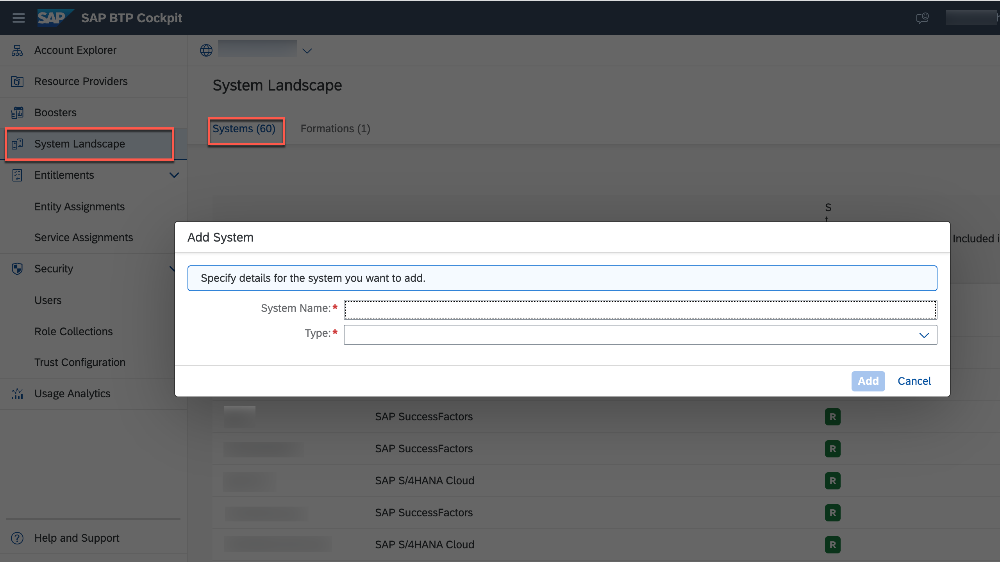

4. In the dropdown list for **Type**, choose `SAP S/4HANA Cloud`.

5. Choose **Register**.

SAP BTP generates an integration token so the SAP S/4HANA Cloud system administrator can configure integration with the SAP BTP from your SAP S/4HANA Cloud system.

 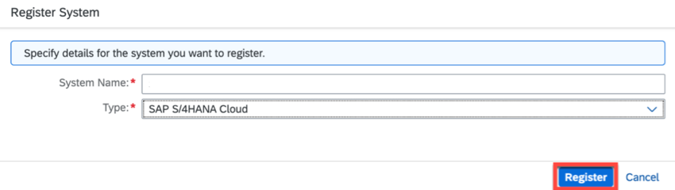

6. Copy the generated token and close the dialog box.

 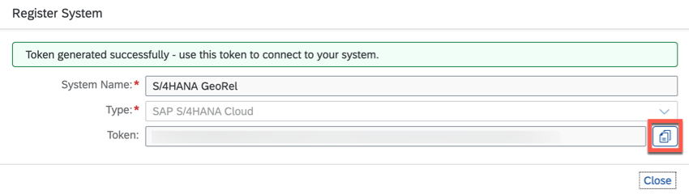

### Add Integration Token to SAP S/4HANA Cloud System

1. Log in to your SAP S/4HANA Cloud tenant.

2. Navigate from **Home** to **Communication Management** tab and choose the tile **Maintain Extensions on SAP BTP**.

 

3. On **Maintain Extensions on SAP BTP** screen in the **Extensions** section, choose **New**.

 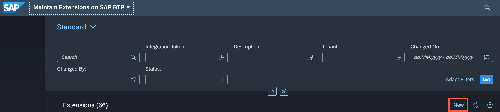

4. In the **Integration Token** field, paste in the integration token generated and copied from SAP BTP (see previous steps 5 and 6).

 

5. Enter a **Description** for your system integration token.

- Recommendation: Use the same name you entered in SAP BTP when you generated the token in the previous step.

6. Choose **Save**.

- A new entry is displayed for your system in the table with the status *Enabling*.
- Wait for a few seconds.
- After the automated integration, the status of your system integration changes to *Enabled*.
- The same takes place on the SAP BTP side. Wait until the status displayed for your newly registered system switches to **Registered** – potentially you need to refresh your page.


## Set Up Entitlements for Your SAP BTP Subaccount

After you have connected the SAP S/4HANA Cloud system (with status **Enabled** in your SAP S/4HANA Cloud tenant) to the SAP BTP, you need to configure entitlements to make this system accessible in the SAP BTP subaccount in which you want to build your extension application.

In the next steps, you will configure the entitlements and assign the corresponding quota and service plans to the subaccount in which the extension application will reside.

> As a prerequisite both a subaccount with Cloud Foundry enabled and a space need to have been created.

In case that you do not have a subaccount for SAP BTP in place you have to follow these steps:

1. In [SAP BTP Cockpit](https://account.hana.ondemand.com/), open your global account.

2. Create a Subaccount.

3. Enable Cloud Foundry for your new subaccount.

4. Create a Spac in your new subaccount.

See sections [Create a Subaccount](https://help.sap.com/viewer/65de2977205c403bbc107264b8eccf4b/Cloud/en-US/05280a123d3044ae97457a25b3013918.html?q=subaccount) and [Create Spaces](https://help.sap.com/viewer/65de2977205c403bbc107264b8eccf4b/Cloud/en-US/2f6ed22ccf424dae84345f4500c2d8ea.html) the  BTP documentation for more details.

## Set Up Entitlement for SAP S/4HANA Cloud Extensibility

1. In the [SAP BTP Cockpit](https://account.hana.ondemand.com/), open your global account and navigate to **Entitlements** &rarr; **Subaccount Assignments**.

 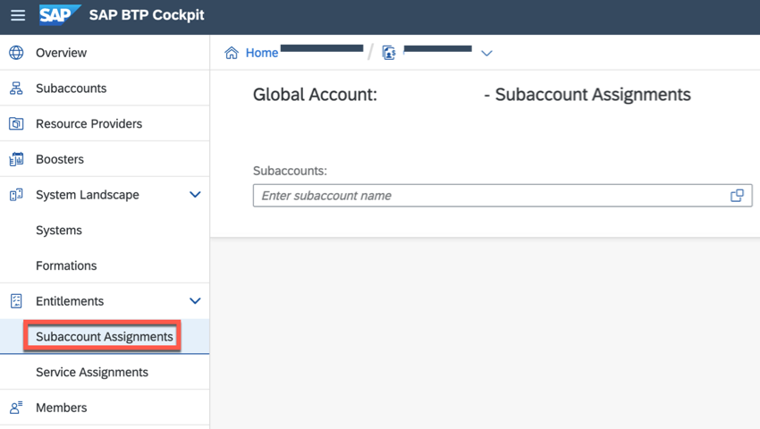

2. In the Subaccounts dropdown list, select your subaccount and choose **Ok**.

3. Choose **Configure Entitlements** &rarr; **Add Service Plans**.

 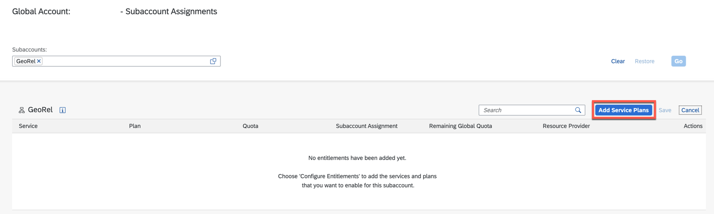

4. In the **Subaccount Entitlements** dialog box, select the service **SAP S/4HANA Cloud Extensibility**.

 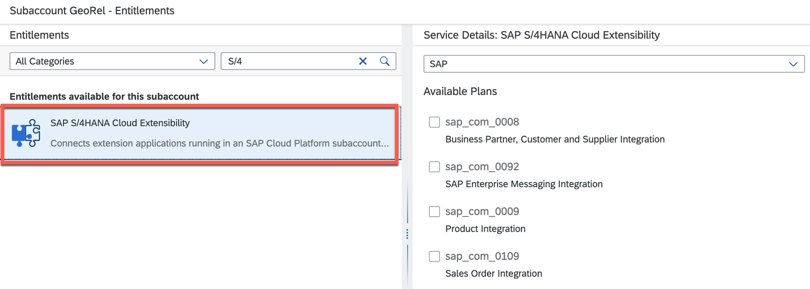

5. In the **Service Details: SAP S/4HANA Cloud Extensibility** screen area, select your newly registered system name from the dropdown help to list the available service plans. These available service plans are:

- *messaging* - to consume SAP S/4HANA Cloud events and create event-based extensions using the event bus from SAP Event Mesh Integration
- *api-access* - for generic access to SAP S/4HANA Cloud APIs

 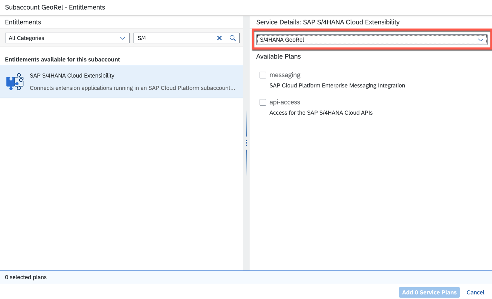

6. Select both service plans.

7. Choose **Add 2 Service Plans** to add these entitlements for the SAP S/4HANA Cloud Extensibility service for your SAP S/4HANA Cloud system registered to your subaccount.

7. Choose **Save**.

 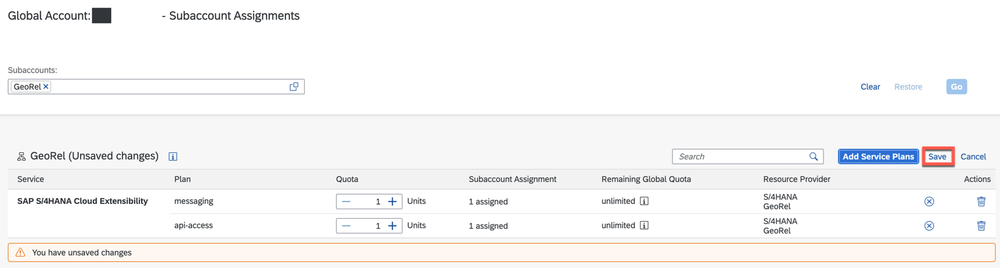


### Set Up Entitlement for SAP Event Mesh

1. Choose **Configure Entitlements** &rarr; **Add Service Plan**.

2. In the **Subaccount Entitlements** dialog box, select the service **Event Mesh**.

 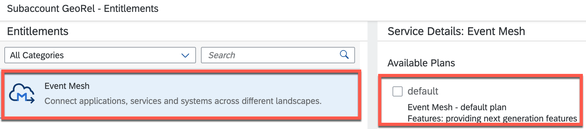

3. In the **Service Details: Event Mesh** screen area, select the service plan **default**.

4. Choose **Add 1 Service Plan** to add this entitlement for the SAP Event Mesh service for your subaccount.

5. Choose **Save**.


## Set Up Entitlement for Cloud Foundry Runtime

1. Choose **Configure Entitlements** &rarr; **Add Service Plan**.

2. In the **Subaccount Entitlements** dialog box, select the service **Cloud Foundry Runtime**.

 

3. In the **Service Details: Cloud Foundry Runtime** screen area, select the service plan **MEMORY**.

4. Choose **Add 1 Service Plan** to add this entitlement for the Cloud Foundry Runtime service for your subaccount.

5. Choose **Save**.

**Check**

Your service entitlements overview should look like this:

 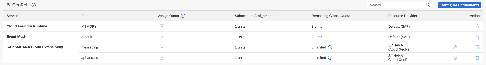


# Create Service Instances of SAP S/4HANA Cloud Extensibility Service with Service Plans

To allow SAP BTP applications to consume events and APIs from SAP S/4HANA Cloud, you need to create the relevant service instances of SAP S/4HANA Cloud Extensibility for the service plans *api-access* and *messaging*.

## Create Service Instance with Service Plan *messaging*

You need to create a new service instance of SAP S/4HANA Cloud Extensibility with service plan *messaging* for enterprise eventing integration.

1. Go to your subaccount.

2. Navigate to **Service Marketplace** and choose **SAP S/4HANA Cloud Extensibility**.

 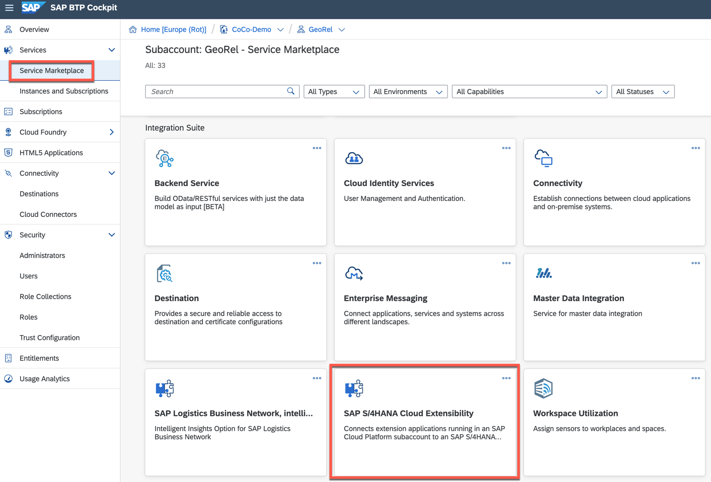

3. Choose **Create**.

 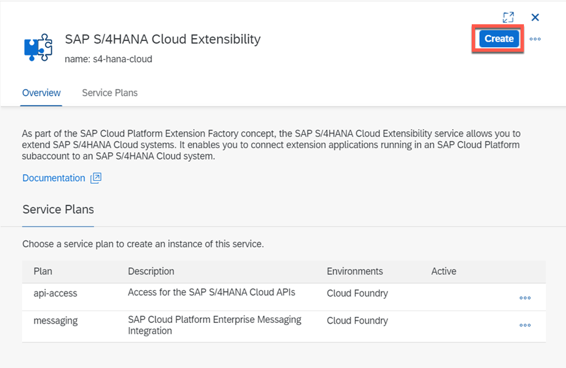

4. In the **New Instance or Subscription** wizard, select the **Service** *SAP S/4HANA Cloud Extensibility* with **plan** *messaging* from the dropdown lists. Choose a CLI-friendly **Instance Name** for your instance, for example, *georelmessaging*.

   > You can freely choose the instance name. You would have to do a few changes in the provided code later on, so for simplicity it is recommended to stick to `georelmessaging` as this is the name we use in the code.

 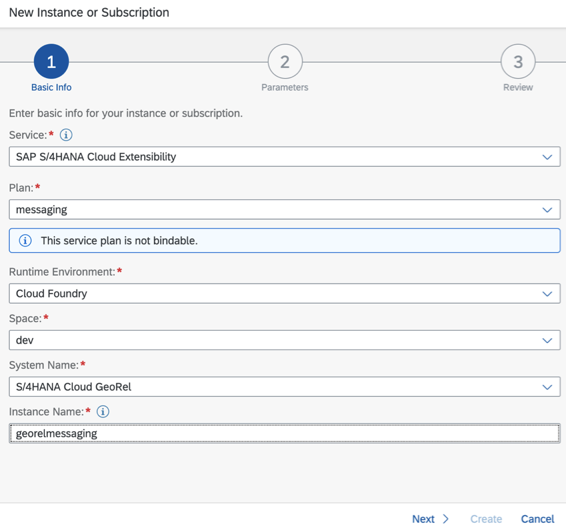

5. Choose **Next**.

6. In the **Specify Parameters** dialog box, use the following template, which should have been prefilled for you.

- The *emClientId* you can freely choose following the conventions - unless it is already in use - and according to the conventions it must contain between 1 and 4 alphanumeric characters (a-z, A-Z, 0-9). Use, for example, your birthday (for example, *1908*).
- See section [Define SAP S/4HANA Cloud Extensibility Service Descriptor JSON File](https://help.sap.com/viewer/65de2977205c403bbc107264b8eccf4b/Cloud/en-US/2d50d91f0d684bba98d323e9f4258cda.html) in the SAP BTP documentation for more details.

    ```
    {

    "emClientId": "<Add your emClientId here>",

    "systemName": "<S/4HANA Cloud system name>"

    }
    ```

 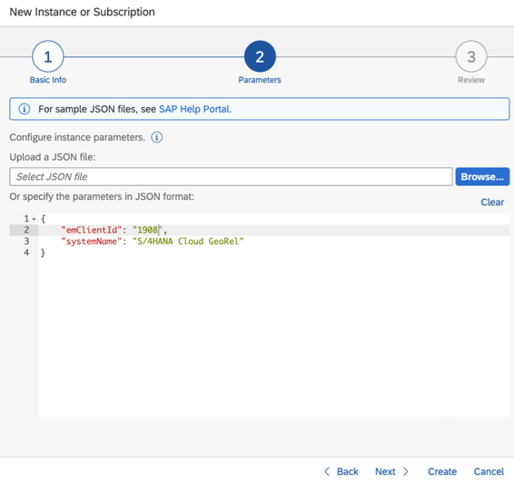


7. Choose **Create** and the newly created instance appears in the list of instances in the Instance panel.

## Create Service Instance with Service Plan *api-access*

You need to create a new service instance of SAP S/4HANA Cloud Extensibility with service plan *api-access* to access the BusinessPartner API and enable its usage.

1. Go to your subaccount.

2. Navigate to **Service Marketplace** and choose **SAP S/4HANA Cloud Extensibility**.

3. Choose **Create**.

4. In the **Create wizard** in the Service dropdown list, select the service **SAP S/4HANA Cloud Extensibility**.

5. Select the Service Plan **api-access**, which you use for generic access to APIs in your SAP S/4HANA Cloud system.

   Use **xf_api_bupa** as your **Instance Name**.

    > You can freely choose the instance name. You would have to do a few changes in the provided code later on though if you use your own name, so for simplicity it is recommended to stick to `xf_api_bupa`.


 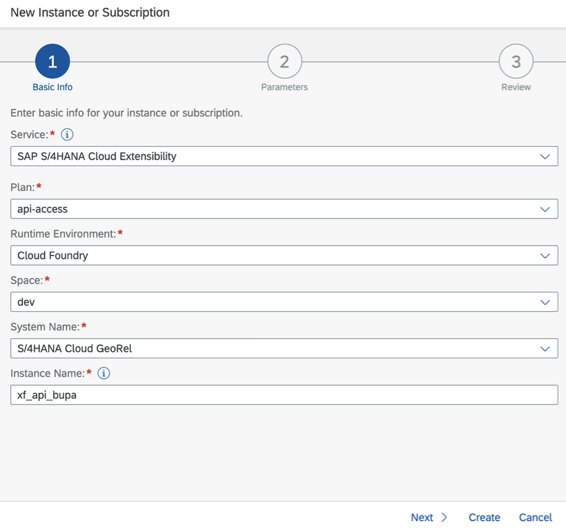

6. Choose **Next**.

7. In the **Specify Parameters** dialog box, you need to copy the following template and paste it into that box replacing the content filled in there automatically.

 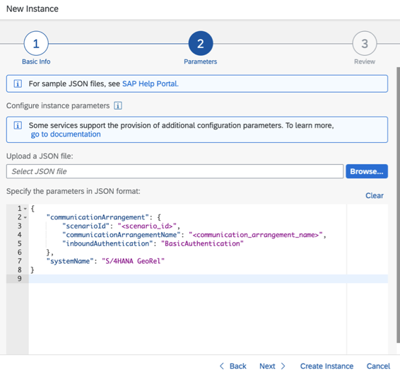

8. Copy the following template, considering line breaks.

- As "systemName" you must enter the name of your newly registered system. The system name should be prefilled in the content you are replacing - so you can just copy it to an editor before and the just copy it back into the template.
- As "communicationArrangementName" you must enter a speaking name for your communication arrangement.

```
{
    "systemName": "<SYSTEM NAME>",
    "communicationArrangement": {
        "communicationArrangementName": "<ARRANGEMENT NAME>",
        "scenarioId": "SAP_COM_0008",
        "inboundAuthentication": "BasicAuthentication",
        "outboundAuthentication": "BasicAuthentication",
        "outboundServices": [
            {
                "name": "Replicate Customers from S/4 System to Client",
                "isServiceActive": false
            },
            {
                "name": "Replicate Suppliers from S/4 System to Client",
                "isServiceActive": false
            },
            {
                "name": "Replicate Company Addresses from S/4 System to Client",
                "isServiceActive": false
            },
            {
                "name": "Replicate Workplace Addresses from S/4 System to Client",
                "isServiceActive": false
            },
            {
                "name": "Replicate Personal Addresses from S/4 System to Client",
                "isServiceActive": false
            },
            {
                "name": "Business Partner - Replicate from SAP S/4HANA Cloud to Client",
                "isServiceActive": false
            },
            {
                "name": "Business Partner Relationship - Replicate from SAP S/4HANA Cloud to Client",
                "isServiceActive": false
            },
            {
                "name": "Business Partner - Send Confirmation from SAP S/4HANA Cloud to Client",
                "isServiceActive": false
            },
            {
                "name": "BP Relationship - Send Confirmation from SAP S/4HANA Cloud to Client",
                "isServiceActive": false
            }
        ],
        "communicationSystem": {
            "communicationSystemHostname": "default.com",
            "outboundCommunicationUser": {
                "username": "DefaultUser",
                "password": "DefaultPassword"
            }
        }
    }
}
```

See section [Communication Arrangement JSON File - Properties](https://help.sap.com/viewer/65de2977205c403bbc107264b8eccf4b/Cloud/en-US/553a4c6b98be4c1ba7d1dfa0e9df8669.html) in the SAP BTP documentation for more details.

8. Choose **Next**.

9. Choose **Create**.

The newly created instance appears in the list of instances in the **Instance** panel.

 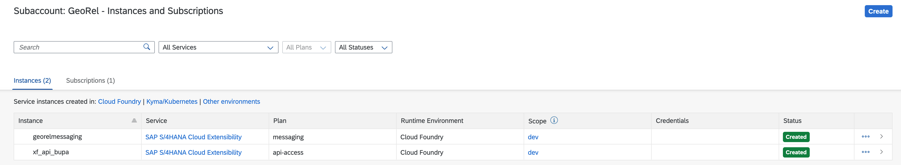


# Manage Your Solution for Event Handling in SAP S/4HANA Cloud System

You need to enable the events that are to be sent from your SAP S/4HANA Cloud system to SAP BTP. For this enablement step, you need to go to your SAP S/4HANA system and maintain Event Topics in the Enterprise Event Enablement app. See section [Maintain Event Topics for a Channel](https://help.sap.com/viewer/7dde0e0e3a294f01a6f7870731c5e4ad/SHIP/en-US/1aafa0717c08461ba05ee846caec46b7.html) in the SAP Extensibility Explorer for SAP S/4HANA Cloud documentation for more details.

1. Log in to your SAP S/4HANA Cloud system.

2. Navigate to **Enterprise Event Enablement** &rarr; **Enterprise Event Enablement**.

 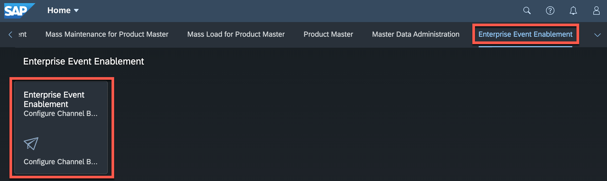

3. Choose **Go**.

4. Select your event **Channel** from the list.

> Look for your `emClientId` that you had provided in an earlier step.

 

5. Choose **Create** for your **Outbound Topic**.

 

6. Choose the Topic selector.

7. Enter `*BusinessPartner*` into the **Topic** filter.

8. Choose **Go**.

 

9. Select **Outbound Topic** `sap/s4/beh/businesspartner/v1/BusinessPartner/*`.

 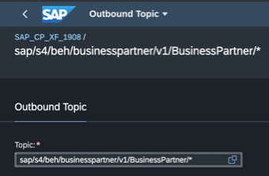

10. Choose **Create**.


