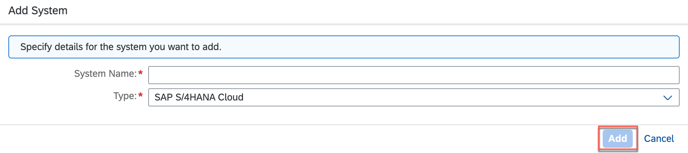
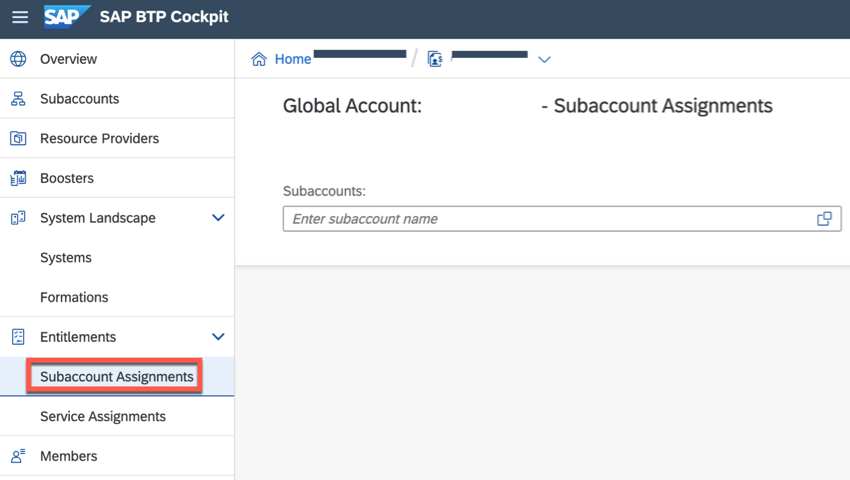
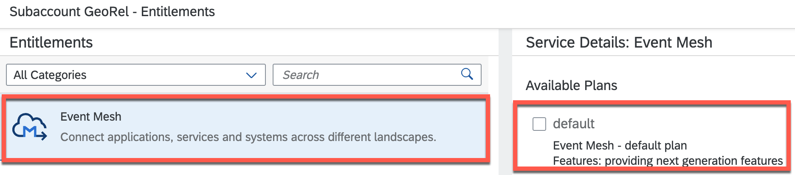
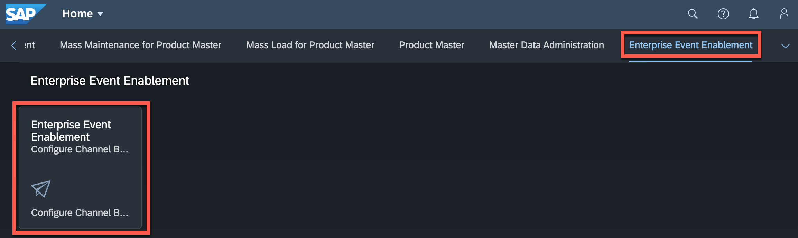

# Set Up SAP BTP and SAP S/4HANA Cloud
## Set Up Connectivity and Extensibility

To build extension applications for your SAP S/4HANA Cloud system, you need to connect your SAP S/4HANA Cloud system to your SAP BTP global account.

## Register Your SAP S/4HANA Cloud System

Register your SAP S/4HANA Cloud system in your SAP BTP cockpit, in respect to authorizations, you must be:
- An administrator of the SAP BTP global account
- An administrator of the SAP S/4HANA Cloud system

## Connect SAP S/4HANA Cloud to SAP BTP

To do that, you must register your SAP S/4HANA Cloud system in your global account in SAP BTP. During this process, an integration token is created and then used by the SAP S/4HANA Cloud system tenant administrator to configure the integration on the SAP S/4HANA Cloud system side.

1. In the SAP BTP cockpit, navigate to your global account, and then choose **System Landscape**.

2. In the **Systems** tab, choose **Add System**.

 

3. In the **Add System** dialog box:

- Enter a name for the system you want to register.
> Use only printable ASCII characters.

- In the **Type** dropdown list, select the system type.

 

- Choose **Add**.

 > SAP BTP generates an integration token that the tenant administrator of the extended SAP S/4HANA Cloud system uses when configuring the integration between your SAP S/4HANA Cloud system and the cloud platform on the respective SAP S/4HANA Cloud system side.

4. To get a token to register this system with global account, choose **Get Token**. You need it for configuring the integration on the extended SAP S/4HANA Cloud system side.

5. Copy the registration token and close the dialog box.

 

 > The SAP S/4HANA Cloud system appears in the list of added systems. Its status is Pending because the registration process is not yet completed.

## Trigger the Registration in the SAP S/4HANA Cloud Tenant

1. Log on to the SAP S/4HANA Cloud tenant, go to the **Home > Communication Management** tab page, and then choose the **Maintain Extensions on SAP BTP** tile.


2. On the **Maintain Extensions on SAP BTP** screen, choose **New** in the **Integrations section**.

3. In the **Integration Token** field, enter the content of the integration token you have copied in the SAP BTP cockpit.

 

4. Choose **Save**.

> A new entry with status **Enabling** appears in the table.

5. After the integration has finished successfully, you can refresh the table.

> The status of the integration should have changed to **Enabled**.

6. In the SAP BTP cockpit, check the status of the registration process. To do so, navigate to your global account, and on the **System Landscape** page, check if the status of the SAP system has changed to **Registered**.

> If you are already on the **System Landscape** page, refresh the page to check if the status has changed.
You can register a system only once with the same name per global account.

## Make SAP S/4HANA Cloud System Accessible in Your Subaccount

After you have connected the SAP S/4HANA Cloud system (with status **Enabled** in your SAP S/4HANA Cloud tenant) to the SAP BTP, you need to configure entitlements to make this system accessible in the SAP BTP subaccount in which you want to build your extension application.

> In case that you do not have a subaccount for SAP BTP in place, see sections [Create a Subaccount](https://help.sap.com/viewer/65de2977205c403bbc107264b8eccf4b/Cloud/en-US/05280a123d3044ae97457a25b3013918.html?q=subaccount) and [Create Spaces](https://help.sap.com/viewer/65de2977205c403bbc107264b8eccf4b/Cloud/en-US/2f6ed22ccf424dae84345f4500c2d8ea.html) in the SAP BTP documentation for more details.

1. In the SAP BTP cockpit, navigate to your global account.

2. In the navigation area, choose **Entitlements > Entity Assignments**.

3. Select your subaccount from the **Select Entities:** drop down menu, and then choose **Go**.

 

4. Choose **Configure Entitlements** &rarr; **Add Service Plans**.

 

5. Select the **SAP S/4HANA Cloud Extensibility** service.

6. In the **Service Details: SAP S/4HANA Cloud Extensibility** screen area, select your newly registered system name from the dropdown help to list the available service plans. Available service plans are:

- *messaging* - to consume SAP S/4HANA Cloud events and create event-based extensions using the event bus from SAP Event Mesh Integration.
- *api-access* - for generic access to SAP S/4HANA Cloud APIs.

 

7. Select both service plans.

8. Choose **Add 2 Service Plans** to add these entitlements for the SAP S/4HANA Cloud Extensibility service for your SAP S/4HANA Cloud system registered to your subaccount.

9. **Save** the changes.

 

## Configure Entitlements for SAP BTP, Cloud Foundry Runtime

1. Make sure you are logged on to SAP BTP cockpit as a Cloud Foundry administrator.

2. Choose **Entitlements > Entity Assignments**.

3. If there is no entry for the Cloud Foundry runtime, choose **Configure Entitlements**, and then **Add Service Plans**.

4. In the popup, proceed as follows:

- Choose **Cloud Foundry Runtime**.

- Under Available Service Plans, select the **MEMORY** checkbox.

 

- Choose **Add 1 Service Plan**.

## Configure Entitlement for SAP Event Mesh

1. Choose **Configure Entitlements** &rarr; **Add Service Plan**.

2. In the **Subaccount Entitlements** dialog box, select the service **Event Mesh**.

 

3. In the **Service Details: Event Mesh** screen area, select the service plan **default**.

4. Choose **Add 1 Service Plan** to add this entitlement for the SAP Event Mesh service for your subaccount.

5. Choose **Save**.

# Create SAP S/4HANA Cloud Extensibility Service Instance

To allow SAP BTP applications to consume events and APIs from SAP S/4HANA Cloud, you need to create the relevant service instances of SAP S/4HANA Cloud Extensibility for the service plans **api-access** and **messaging**.

## Create Service Instance with Service Plan *api-access*

To consume the SAP S/4HANA Cloud APIs, you create an SAP S/4HANA Cloud Extensibility service instance using the api-access service plan.

During the service instance creation, an HTTP destination on a subaccount level is automatically generated in this subaccount. You use this destination to establish connection to your SAP S/4HANA Cloud system. When creating the service instance, you configure the communication arrangement and the authentication type for the connection in a JSON file.

1. In the cockpit, navigate to your subaccount, choose **Service Marketplace**, and on the **Service Marketplace** screen, search for the **SAP S/4HANA Cloud Extensibility** service.

2. From the **SAP S/4HANA Cloud Extensibility service** tile, choose **Create** and follow the steps in the wizard to create the service instance.

 

3. On the **Basic Info** step:

- Make sure to select the **api-access** service plan.

- In the Runtime Environment field, choose **Cloud Foundry***.

- In the **Space** field, select the space you are working with.

- In the **System Name** field, select your registered SAP S/4HANA Cloud system.

- In the Instance Name field, enter `xf_api_bupa`.

 

4.Choose **Next**.

5. In the **Specify the parameters in JSON format** dialog box, you need to copy the template from the next step and paste it into that box replacing the content filled in there automatically.

 

6. Copy the following template, considering line breaks.

- As "systemName" you must enter the name of your newly registered system. The system name should be prefilled in the content you are replacing - so you can just copy it to an editor before and the just copy it back into the template.
- As "communicationArrangementName" you must enter a speaking name for your communication arrangement.

```
{
    "systemName": "<SYSTEM NAME>",
    "communicationArrangement": {
        "communicationArrangementName": "<ARRANGEMENT NAME>",
        "scenarioId": "SAP_COM_0008",
        "inboundAuthentication": "BasicAuthentication",
        "outboundAuthentication": "BasicAuthentication",
        "outboundServices": [
            {
                "name": "Replicate Customers from S/4 System to Client",
                "isServiceActive": false
            },
            {
                "name": "Replicate Suppliers from S/4 System to Client",
                "isServiceActive": false
            },
            {
                "name": "Replicate Company Addresses from S/4 System to Client",
                "isServiceActive": false
            },
            {
                "name": "Replicate Workplace Addresses from S/4 System to Client",
                "isServiceActive": false
            },
            {
                "name": "Replicate Personal Addresses from S/4 System to Client",
                "isServiceActive": false
            },
            {
                "name": "Business Partner - Replicate from SAP S/4HANA Cloud to Client",
                "isServiceActive": false
            },
            {
                "name": "Business Partner Relationship - Replicate from SAP S/4HANA Cloud to Client",
                "isServiceActive": false
            },
            {
                "name": "Business Partner - Send Confirmation from SAP S/4HANA Cloud to Client",
                "isServiceActive": false
            },
            {
                "name": "BP Relationship - Send Confirmation from SAP S/4HANA Cloud to Client",
                "isServiceActive": false
            }
        ],
        "communicationSystem": {
            "communicationSystemHostname": "default.com",
            "outboundCommunicationUser": {
                "username": "DefaultUser",
                "password": "DefaultPassword"
            }
        }
    }
}
```

> See section [Communication Arrangement JSON File - Properties](https://help.sap.com/viewer/65de2977205c403bbc107264b8eccf4b/Cloud/en-US/553a4c6b98be4c1ba7d1dfa0e9df8669.html) in the SAP BTP documentation for more details.

7. Choose **Create**.

## Create Service Instance with Service Plan *messaging*

To consume SAP S/4HANA Cloud events, you need to configure the connectivity between SAP Event Mesh and the SAP S/4HANA Cloud tenant. To do so, you need to create and configure service instances for both SAP S/4HANA Cloud Extensibility service and SAP Event Mesh.

1. In the SAP BTP cockpit, navigate to the subaccount in which you want to create a service instance.

2. Navigate to **Services &rarr; Service Marketplace** and choose **SAP S/4HANA Cloud Extensibility**.

 

3. From the **SAP S/4HANA Cloud Extensibility service** tile, choose **Create** and follow the steps in the wizard to create the service instance.

 

3. On the **Basic Info** step:

- Make sure to select the **messaging** service plan.

- In the Runtime Environment field, choose **Cloud Foundry***.

- In the **Space** field, select the space you are working with.

- In the **System Name** field, select your registered SAP S/4HANA Cloud system.

- Choose a CLI-friendly **Instance Name** for your instance, for example, *georelmessaging*.

  

4. Choose **Next**.

5. In the **Specify Parameters** dialog box, use the following template, which should have been prefilled for you.

- The *emClientId* you can freely choose following the conventions - unless it is already in use - and according to the conventions it must contain between 1 and 4 alphanumeric characters (a-z, A-Z, 0-9). Use, for example, your birthday (for example, *1908*).
- See section [Define SAP S/4HANA Cloud Extensibility Service Descriptor JSON File](https://help.sap.com/viewer/65de2977205c403bbc107264b8eccf4b/Cloud/en-US/2d50d91f0d684bba98d323e9f4258cda.html) in the SAP BTP documentation for more details.

    ```
    {

    "emClientId": "<Add your emClientId here>",

    "systemName": "<S/4HANA Cloud system name>"

    }
    ```

 


7. Choose **Create** and the newly created instance appears in the list of instances in the Instance panel.

# Manage Your Solution for Event Handling in the SAP S/4HANA Cloud System

You need to enable the events that are to be sent from your SAP S/4HANA Cloud system to SAP BTP. For this enablement step, you need to go to your SAP S/4HANA system and maintain Event Topics in the Enterprise Event Enablement app. See section [Maintain Event Topics for a Channel](https://help.sap.com/viewer/7dde0e0e3a294f01a6f7870731c5e4ad/SHIP/en-US/1aafa0717c08461ba05ee846caec46b7.html) in the SAP Extensibility Explorer for SAP S/4HANA Cloud documentation for more details.

1. Log in to your SAP S/4HANA Cloud system.

2. Navigate to **Enterprise Event Enablement** &rarr; **Enterprise Event Enablement**.

 

3. Choose **Go**.

4. Select your event **Channel** from the list.

> Look for your `emClientId` that you had provided in an earlier step.

 

5. Choose **Create** for your **Outbound Topic**.

 

6. Choose the Topic selector.

7. Enter `*BusinessPartner*` into the **Topic** filter.

8. Choose **Go**.

 

9. Select **Outbound Topic** `sap/s4/beh/businesspartner/v1/BusinessPartner/*`.

 

10. Choose **Create**.


