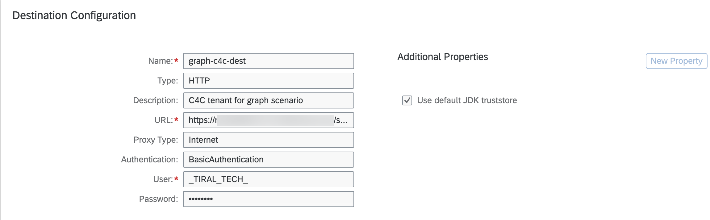

# Set Up SAP BTP and SAP Sales Cloud
## Set Up Communication Arrangements in the Sales Cloud System

To build extension applications for your SAP Sales Cloud system, you need to connect your SAP Sales Cloud system to your global account in SAP BTP.

To be able to do this, you must be:

- An administrator of the global account in SAP BTP 

- An administrator of the SAP Sales Cloud system

## Set Up Communication System

1. Log on to your SAP Sales Cloud tenant.

2. Navigate to **Administrator** &rarr; **General Settings** and open **Communication Systems** under the **Integration** block.

3. Choose **New** to create a new communication system.

4. In the **ID** field, enter *TRIAL_TECH_SYSTEM_USER*. Remember this ID.

5. In the **Hostname** field, enter *ODATA_ACCESS*.

6. In the **System Access Type** field, select **Internet**.

    

7. In the **System instances** view, choose **Add Row**.

8. In the **System Instance ID** field, enter *TRIAL_TECH_SYSTEM_USER*.

    

9. In the menu bar on top, choose **Actions** &rarr; **Set to Active**.

    

## Set Up Communication Arrangement

1. Navigate to **Administrator** &rarr; **General Settings** and open **Communication Arrangement** under the **Integration** block.

2. Choose **New** to create a new communication arrangement.

3. Choose **OData Services for Business Objects** as the Communication scenario.

4. Choose **Next** in the footer menu.

5. In the **System Instance ID** field, choose the communication system name given in the previous step that is **TRIAL_TECH_SYSTEM_USER**.

    

6. Choose **Next** in the footer menu.

7. Set **Communication Method** to **Direct Communication**.

8. Under the **Inbound Communication: Basic Settings** choose **authentication** method as **User ID and Password**.

9. In the Technical **User ID**, choose **Edit credentials**.

10. Enter new password and choose **Ok**. Remember this password.

11. Under the services used, choose the following services:

    - businesspartner
    - customer
    - employeeanduser
    - employeebasicdata
    - objectidentifiermapping

12. Choose **Next** and then **Finish**.

    

## Configure Destination in SAP BTP

You need to configure a destination for your SAP Sales Cloud system, which would be used for Graph configuration in the next steps.

1. Open your global account in SAP BTP and navigate to your subaccount.

2. Choose **Connectivity** in the left-hand navigation and then choose **Destinations** &rarr; **New Destination**.

3. Enter the following information in the **Destination Configuration** view:

    - Name: `graph-c4c-dest`
    - URL: `https://<SAP_Sales_Cloud_API>/sap/c4c/odata/v1/c4codataapi`
    - Authentication: `Basic Authentication`
    - User: `_TIRAL_TECH_`
    - Password: password you have set in the previous step

    

## Set Up the Communication System for the Mapping Business System

1. Log on to your SAP Sales Cloud tenant.

2. Navigate to **Administrator** &rarr; **General Settings** and open **Communication Systems** under the **Integration** block.

3. Choose **New** to create a new communication system.

4. In the **ID** field, enter *GRAPH_S4*.

5. In the **Hostname** field, enter *S4_HANA*.

6. In the **System Access Type** field, choose **Internet**.

7. In the **System instances** view, choose **Add Row**.

8. In the **System Instance ID** field, enter *GRAPH_S4*.

9. In the menu bar on top, choose **Actions** &rarr; **Set to Active**.

    
