# Set Up Graph

Graph is a capability of API Management within SAP Integration Suite. With Graph, developers access business data as a single semantically connected data graph, spanning the suite of SAP products and beyond. Graph is a solution to unify your business APIs in the form of a semantically connected data graph, accessed via a single powerful API.

As part of SAP Integration Suite, Graph is compatible with SAP's Cloud Application Programming model (CAP) and with the range of SAP Build development solutions.

## Set Up Graph capability in SAP Integration Suite, API Management

To use Graph in SAP BTP, a subscription for `SAP Integration Suite` needs to be created in the SAP BTP Subaccount. It requires administrator authorization of SAP BTP.

### Subscribe to SAP Integration Suite

1. In your SAP BTP subaccount, navigate to **Services** &rarr; **Instances and Subscriptions** in the left-hand pane. A new **Instance or Subscription** wizard opens.

2. Enter the basic information for your instance.

3. In the **Service** dropdown menu, select **SAP Integration Suite**.

4. In the **Plan** dropdown menu, select **enterprise_agreement**.


5. Choose **Create**.

<!-- 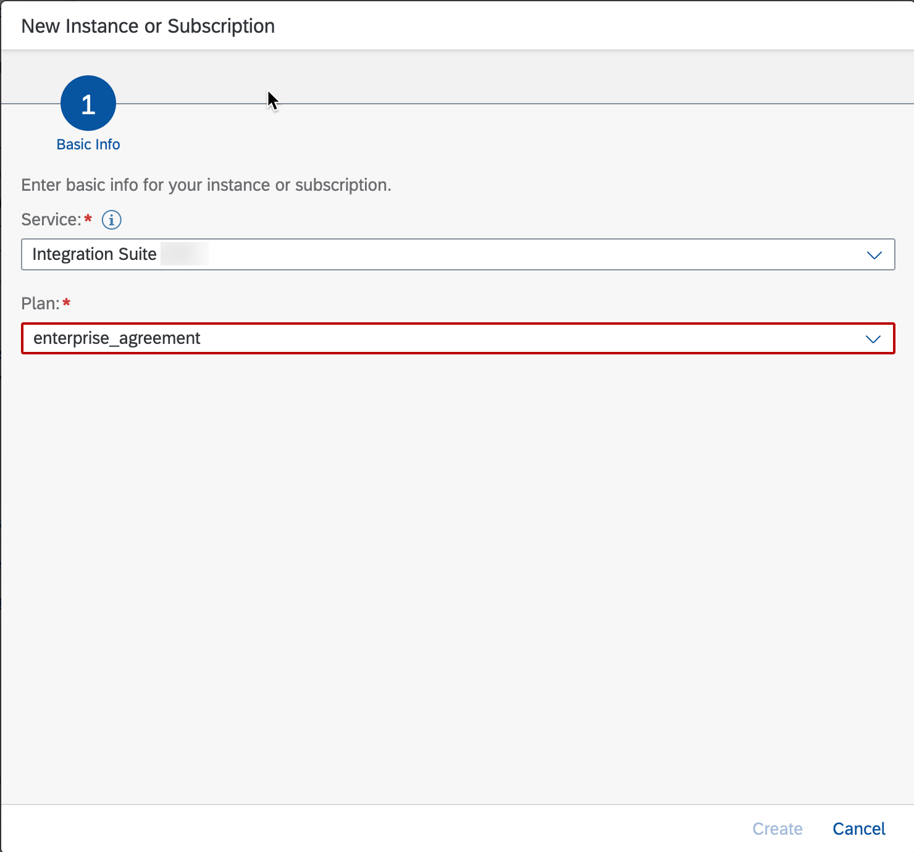 -->


### Assing Role Collection

Make sure to assign the `Integration_Provisioner` role collection to the user.

<!-- 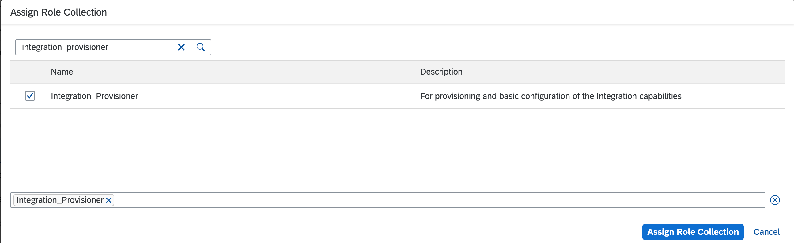 -->


### Activate Graph

1. Select **Go to Application** for the Integration Suite application. The Integration Suite launchpad opens in new tab.

<!-- 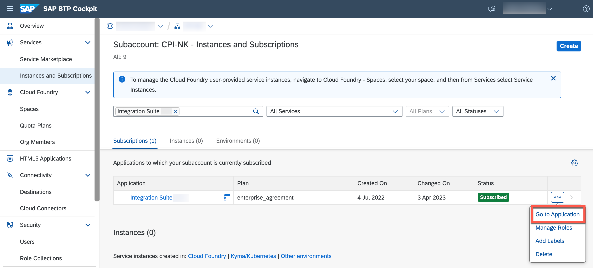 -->


2. In the capabilities section, look for `Manage Capabilities/Add Capabilities`

3. Ensure the **Manage APIs** capability is enabled.

<!-- 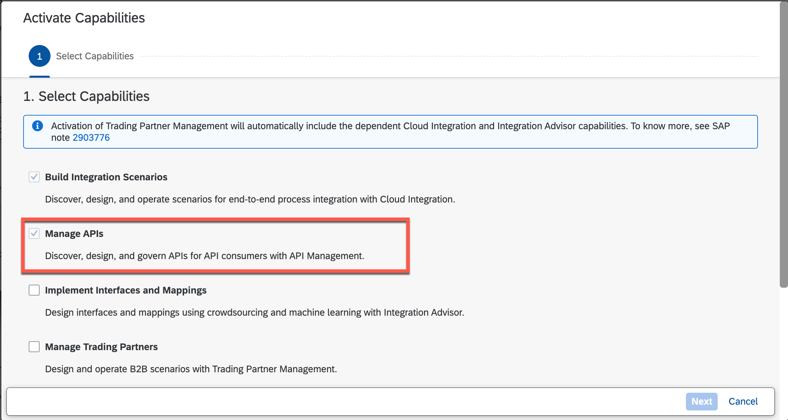 -->


4. Enable `Graph` in the capabilities.

<!-- 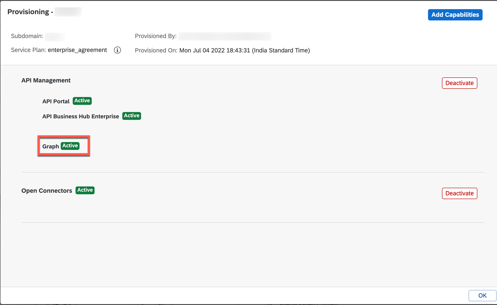 -->


wait to have the `Active` status.

5. Then log out of the Integration Suite application and switch back to the SAP BTP subaccount.

6. Assign the role collection to the user

7. Go to **Users** > Select user > **Assign Role collection** > select 

 - **APIManagement.SelfService.Administrator** 
 - **AuthGroup.SelfService.Admin**
  - **Graph.KeyUser**
  - **GraphNavigation.Viewer** > Assign Role collection.

<!-- 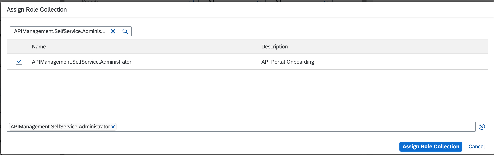 -->


8. Log in back to Integration Suite Application, you should be able to see the `Graph` designer option in the menu.

<!-- 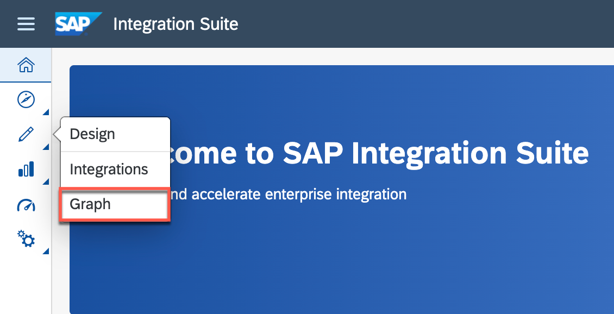 -->


## Connecting Graph to Business Systems

A business data graph reflects the data entities within underlying business systems in a landscape.

### Configure Model Extension

1. Select **Graph** under **Design Artifacts** in the left-side menu of the SAP Integration Suite interface.

<!--  -->


2. Choose **Model Extensions** tab and click on **create from file**.

<!--  -->


3. Give the name **Logistics Partner** and upload the file [Logistics.custom.json](../../logistics-partner/config/Logistics.custom.json) from the config folder.

<!-- 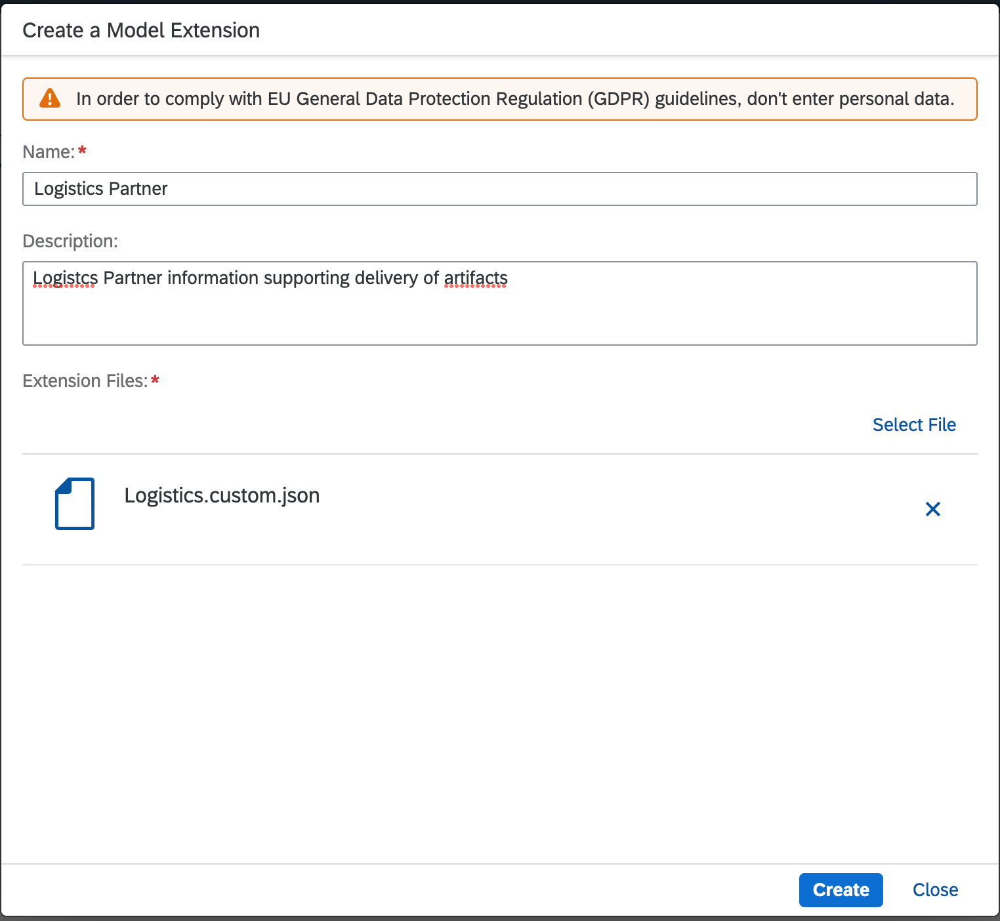 -->


4. Click on **Create**.

Logistics Partner model extension was created successfully and can now be used in a business data graph.

### Create a Business Data Graph

1. Select **Graph** under **Design Artifacts** in the left-side menu of the SAP Integration Suite interface.


<!--  -->


2. Select **Create from file** in the panel

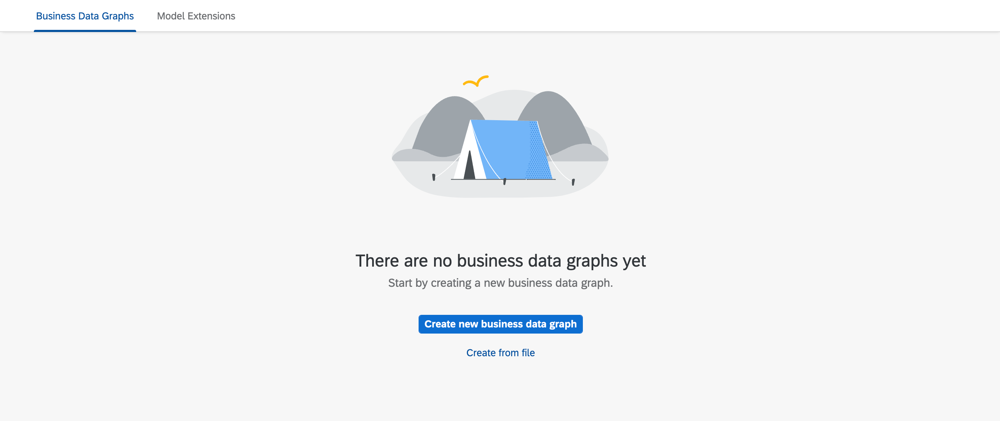

3. Select the [configuration file](./graph-config.json) and click **Next**.

4. The Business Data Configuration should look like this

<!-- 2. Select **Create new business data graph** in the panel.


3. Provide an **ID** for the business data Graph as `v1`. Click **Next**.

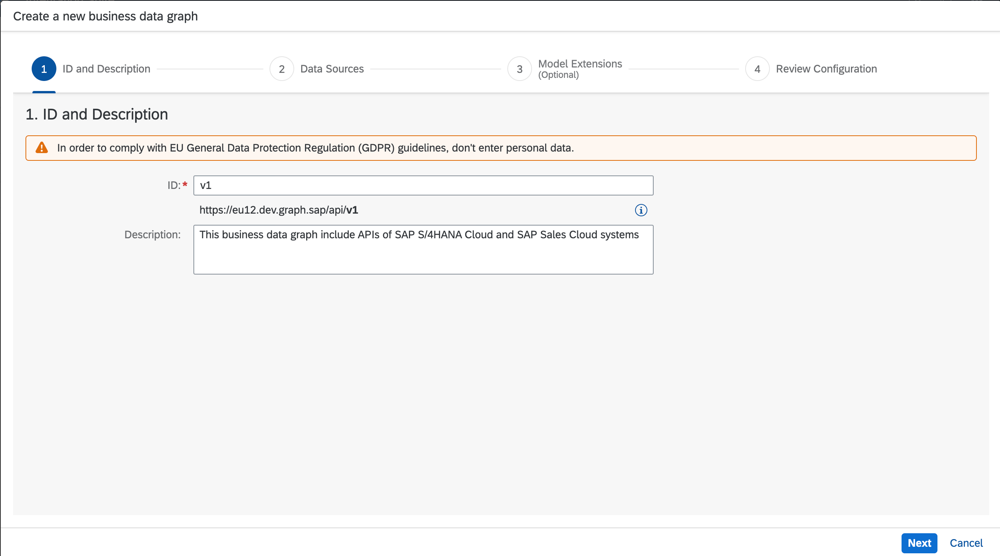

4. Select the data sources to include in the business data graph. These are the destinations you previously configured in the SAP BTP cockpit.

  - bupa
  - graph-c4c-dest
  - logistics-partner


Select **Next**

5. Choose the configured **Model extension** `Logistics Partner` and select **Next**

6. Once the draft busines data gets generated, review the configuration.

7. Add the following Key mappings in the locating policy.

```json
"keyMapping": [
            {
                "foreignKey": {
                    "attributes": [
                        "ExternalID"
                    ],
                    "dataSource": "c4c",
                    "entityName": "sap.c4c.CorporateAccountCollection"
                },
                "references": {
                    "attributes": [
                        "BusinessPartner"
                    ],
                    "dataSource": "s4",
                    "entityName": "sap.s4.A_BusinessPartner"
                }
            },
            {
                "foreignKey": {
                    "attributes": [
                        "ExternalID"
                    ],
                    "dataSource": "c4c",
                    "entityName": "sap.c4c.IndividualCustomerCollection"
                },
                "references": {
                    "attributes": [
                        "BusinessPartner"
                    ],
                    "dataSource": "s4",
                    "entityName": "sap.s4.A_BusinessPartner"
                }
            }
        ]
```

After adding, full configuration should look like this -->

<!-- Select **Create new business data graph** in the panel. -->

```json
{
    "businessDataGraphIdentifier": "v1",
    "description": "This business data graph includes APIs of SAP S/4HANA Cloud and SAP Sales Cloud",
    "graphModelVersion": "^v3",
    "schemaVersion": "1.2.0",
    "extensions": [
        "Logistics Partner"
    ],
    "dataSources": [
        {
            "name": "s4",
            "services": [
                {
                    "destinationName": "xf_api_bupa",
                    "path": "sap/opu/odata/sap/API_BUSINESS_PARTNER"
                }
            ]
        },
        {
            "name": "c4c",
            "services": [
                {
                    "destinationName": "graph-c4c-dest"
                }
            ]
        },
        {
            "name": "my.custom",
            "services": [
                {
                    "destinationName": "logistics-partner"
                }
            ],
            "namespace": "my.custom"
        }
    ],
    "locatingPolicy": {
        "cues": [],
        "keyMapping": [
            {
                "foreignKey": {
                    "attributes": [
                        "ExternalID"
                    ],
                    "dataSource": "c4c",
                    "entityName": "sap.c4c.CorporateAccountCollection"
                },
                "references": {
                    "attributes": [
                        "BusinessPartner"
                    ],
                    "dataSource": "s4",
                    "entityName": "sap.s4.A_BusinessPartner"
                }
            },
            {
                "foreignKey": {
                    "attributes": [
                        "ExternalID"
                    ],
                    "dataSource": "c4c",
                    "entityName": "sap.c4c.IndividualCustomerCollection"
                },
                "references": {
                    "attributes": [
                        "BusinessPartner"
                    ],
                    "dataSource": "s4",
                    "entityName": "sap.s4.A_BusinessPartner"
                }
            }
        ],
        "rules": [
            {
                "name": "sap.s4.*",
                "leading": "s4",
                "local": []
            },
            {
                "name": "sap.c4c.*",
                "leading": "c4c",
                "local": []
            },
            {
                "name": "sap.graph.*",
                "leading": "s4",
                "local": [
                   
                ]
            },
            {
                "name": "sap.graph.AppointmentActivity",
                "leading": "c4c"
            },
            {
                "name": "sap.graph.BusinessUser",
                "leading": "c4c"
            },
            {
                "name": "sap.graph.ClassificationCharacteristic",
                "leading": "c4c"
            },
            {
                "name": "sap.graph.ClassificationClass",
                "leading": "c4c"
            },
            {
                "name": "sap.graph.Company",
                "leading": "c4c"
            },
            {
                "name": "sap.graph.ContactPerson",
                "leading": "c4c",
                "local": [
                    "s4"
                ]
            },
            {
                "name": "sap.graph.CorporateAccount",
                "leading": "c4c",
                "local": [
                    "s4"
                ]
            },
            {
                "name": "sap.graph.Country",
                "leading": "c4c"
            },
            {
                "name": "sap.graph.Currency",
                "leading": "c4c"
            },
            {
                "name": "sap.graph.Customer",
                "leading": "c4c",
                "local": [
                    "s4"
                ]
            },
            {
                "name": "sap.graph.CustomerGroup",
                "leading": "c4c"
            },
            {
                "name": "sap.graph.DistributionChannel",
                "leading": "c4c"
            },
            {
                "name": "sap.graph.Division",
                "leading": "c4c"
            },
            {
                "name": "sap.graph.Equipment",
                "leading": "c4c"
            },
            {
                "name": "sap.graph.FunctionalLocation",
                "leading": "c4c"
            },
            {
                "name": "sap.graph.IncotermsClassification",
                "leading": "c4c"
            },
            {
                "name": "sap.graph.IndividualCustomer",
                "leading": "c4c",
                "local": [
                    "s4"
                ]
            },
            {
                "name": "sap.graph.IndustrySector",
                "leading": "c4c"
            },
            {
                "name": "sap.graph.Job",
                "leading": "c4c"
            },
            {
                "name": "sap.graph.Language",
                "leading": "c4c"
            },
            {
                "name": "sap.graph.MeasurementDocument",
                "leading": "c4c"
            },
            {
                "name": "sap.graph.MeasurementPoint",
                "leading": "c4c"
            },
            {
                "name": "sap.graph.PersonMaritalStatus",
                "leading": "c4c"
            },
            {
                "name": "sap.graph.PersonTitle",
                "leading": "c4c"
            },
            {
                "name": "sap.graph.PhoneCallActivity",
                "leading": "c4c"
            },
            {
                "name": "sap.graph.Product",
                "leading": "c4c"
            },
            {
                "name": "sap.graph.ProductCategory",
                "leading": "c4c"
            },
            {
                "name": "sap.graph.ProductCategoryHierarchy",
                "leading": "c4c"
            },
            {
                "name": "sap.graph.ProductType",
                "leading": "c4c"
            },
            {
                "name": "sap.graph.SalesContract",
                "leading": "c4c"
            },
            {
                "name": "sap.graph.SalesDocumentCancellationReason",
                "leading": "c4c"
            },
            {
                "name": "sap.graph.SalesDocumentReason",
                "leading": "c4c"
            },
            {
                "name": "sap.graph.SalesLead",
                "leading": "c4c"
            },
            {
                "name": "sap.graph.SalesOpportunity",
                "leading": "c4c"
            },
            {
                "name": "sap.graph.SalesOrder",
                "leading": "c4c"
            },
            {
                "name": "sap.graph.SalesOrganization",
                "leading": "c4c"
            },
            {
                "name": "sap.graph.SalesPricingConditionType",
                "leading": "c4c"
            },
            {
                "name": "sap.graph.SalesQuote",
                "leading": "c4c"
            },
            {
                "name": "sap.graph.SalesRoute",
                "leading": "c4c"
            },
            {
                "name": "sap.graph.SalesVisit",
                "leading": "c4c"
            },
            {
                "name": "sap.graph.ServiceDocumentPriority",
                "leading": "c4c"
            },
            {
                "name": "sap.graph.ServiceRequest",
                "leading": "c4c"
            },
            {
                "name": "sap.graph.ServiceRequestType",
                "leading": "c4c"
            },
            {
                "name": "sap.graph.TaskActivity",
                "leading": "c4c"
            },
            {
                "name": "sap.graph.TimeSheet",
                "leading": "c4c"
            },
            {
                "name": "sap.graph.TimeZone",
                "leading": "c4c"
            },
            {
                "name": "sap.graph.WorkAssignment",
                "leading": "c4c"
            },
            {
                "name": "my.custom.*",
                "leading": "my.custom"
            },
            {
                "name": "custom.ns.Logistics",
                "leading": "my.custom",
                "local": []
            },
            {
                "name": "custom.ns.Logistics",
                "leading": "s4",
                "local": [],
                "sourceEntity": "sap.s4.A_BusinessPartner"
            }
        ]
    }
}
```

Click on **Create**.

See [Configuration File](https://help.sap.com/docs/graph/graph/business-data-graph-configuration-file) in the SAP Graph documentation.

7. Wait for status to update to **Available**.

The status goes from Processing > Offline > Available.

### (Optional) Explore the Business Data Graph in Graph Navigator

You just created your business data graph. Wouldn't it be cool to explore semantic connections between the data entitites and even try out a few oData queries on the real data in the business system ? You can do exactly that using Graph Navigator within API Business Hub Enterprise !

This section takes you through exploring the business data graph created in previous section using the Graph Navigator tool.

1. Open the Graph Navigator tool in API Business Hub Enterprise by selecting the menu icon **Graph Navigator** in the top panel.

<!-- 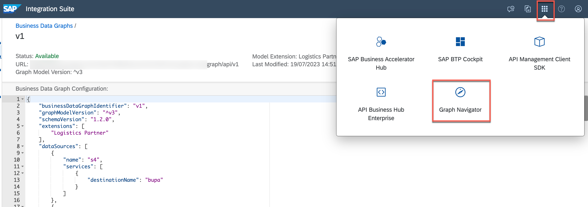 -->


2. The Graph Navigator tool automatically lists all the business data graphs in your SAP BTP subaccount. Select the business data graph **v1** you previously created.

<!-- 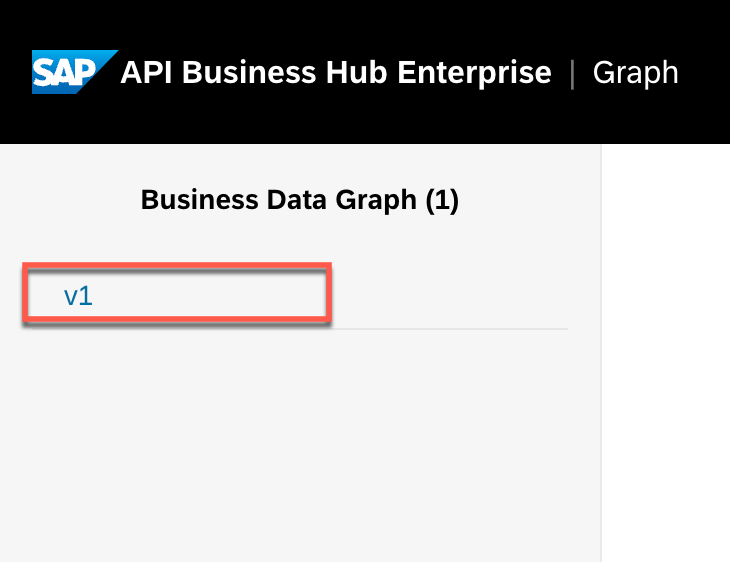 -->


3. On the left, in the **Entities** index, you see a search window and collection of available entities, grouped per namespace.

<!-- 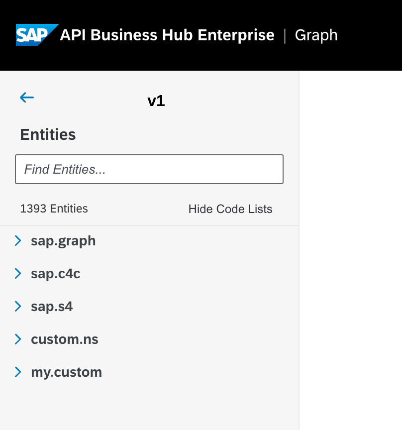 -->


4. Explore the entities to check **Schema** and use the **Try Out** feature to make oData requests.

<!-- 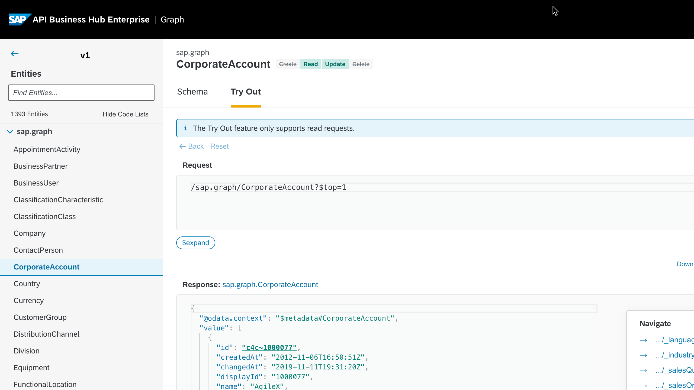 -->


Play around with the navigator.

### Create Graph Service Instance

In order for the client application to be able to consume newly created business data graph, they require Graph service credentials. In this section you will create the Graph service instance and service bindings.

1. In your SAP BTP subaccount, navigate to **Services** &rarr; **Instances and Subscriptions** in the left-hand pane. A new **Instance or Subscription** wizard opens.

2. Enter the basic information for your instance.

3. In the **Service** dropdown menu, select **SAP Graph**.

4. In the **Plan** dropdown menu, select **api**.

5. In the **Instance Name** field, enter a name for your instance.

6. Choose **Create**.

<!-- 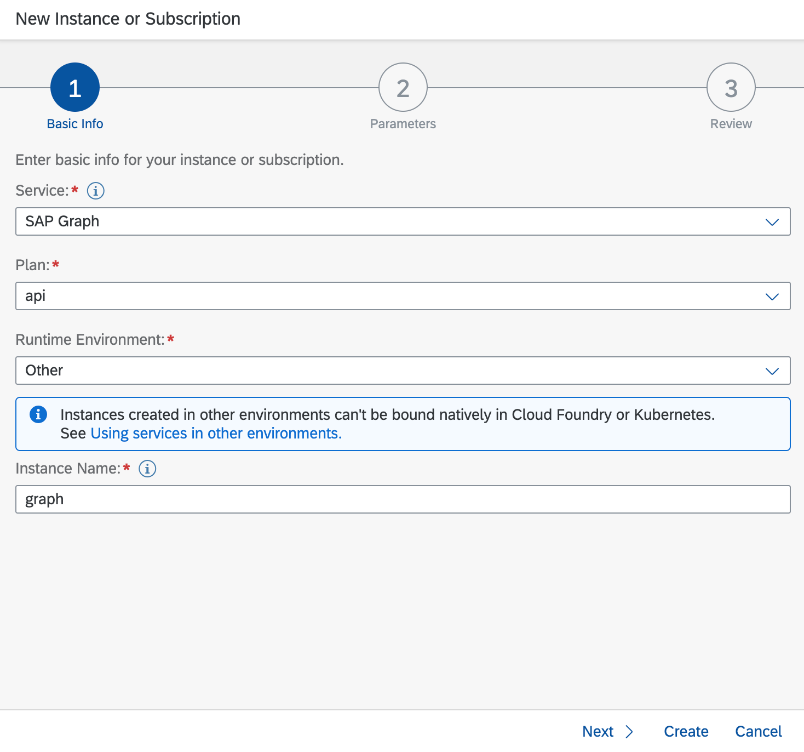 -->


7. Create a new service key for your SAP Graph instance.

<!--  -->


8. Download the service key file.

<!--  -->


## Set Up Graph Destination

Maintain the **Graph API** in the URL (for example, `https://xxxx.graph.sap/api/v1`). This is the URL that you received after activation of graph configuration in the previous step. Refer to Graph's service key to fill in the values for **Client ID** and **Client Secret**. The **Token Service URL** value is derived by suffixing the **URL** mentioned in service key with `/oauth/token`.

Use the Graph API to configure the destinations with:

1. *OAuth2JWTBearer* Authentication:

  1.1. In the SAP BTP cockpit, go to your global account and navigate to your subaccount.

  1.2. Choose **Connectivity** in the menu on the left, and then choose **Destinations > New Destination**.

  1.3. Create the **Destination Configuration** using the details from Service key of the SAP Graph instance:


2. *OAuth2ClientCredential* Authentication:


>Hint: `Check Connection` button for the created destination gives the response `401:Unauthorised`. This is expected. It will be resolved when the application forwards the JWT token.
