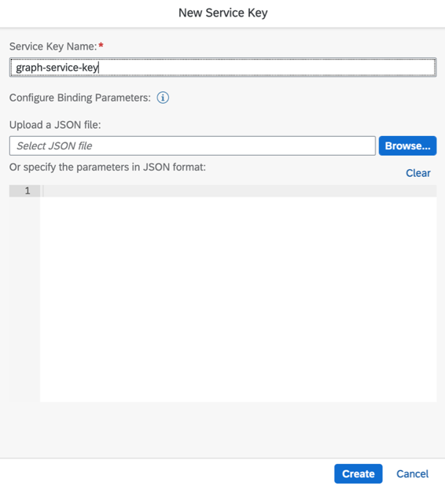
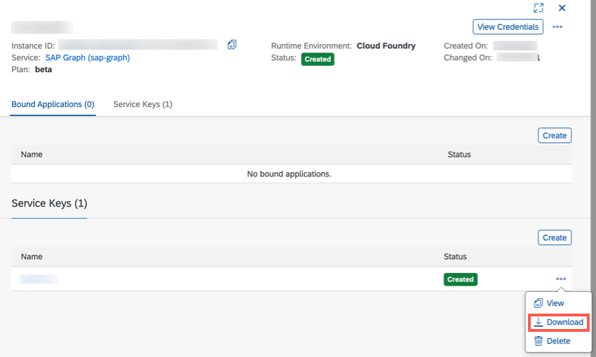
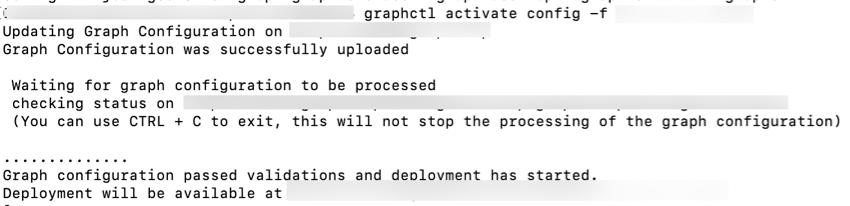
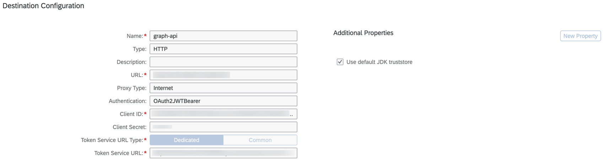
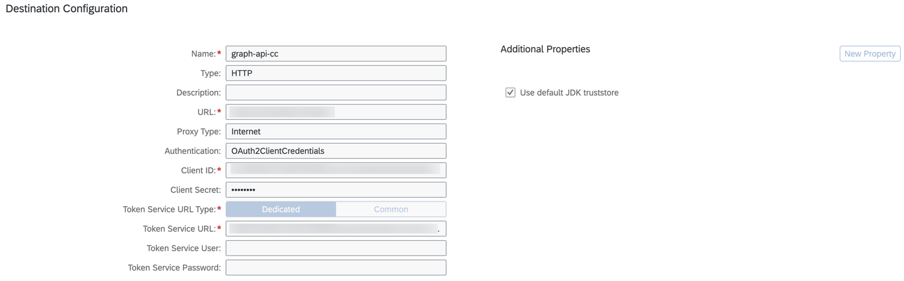

# Set Up SAP Graph

SAP Graph is an API to use the data of the SAP Intelligent Enterprise. It offers an API of connected entities from the SAP domain of business processes. As a SAP BTP service, SAP Graph is compatible with SAP Cloud Application Programming Model (CAP) extension solutions and events managed using SAP Event Mesh.

## Initial Setup

To use SAP Graph in SAP BTP, a service instance needs to be created in the space of your SAP BTP Subaccount. It requires administrator authorization of SAP BTP.

1. In your SAP BTP subaccount, navigate to **Services** &rarr; **Instances and Subscriptions** in the left-hand pane. A new **Instance or Subscription** wizard opens.

2. Enter the basic information for your instance.

3. Select **SAP Graph** from the dropdown list for **Service**.

4. Select **free** as **Plan**.

5. Enter a **Name** for your instance.

6. Choose **Create**.


7. Create a new service key for your SAP Graph instance.



8. **Download** the service key file.



9. To configure SAP Graph, a user must have the `SAP_Graph_Key_User` authorization role. To assign this role to a user, you must create a role collection, add the role of `SAP_Graph_Key_User`, and then assign it to the relevant user. See subsection [Create Role Collection and Add Roles](https://help.sap.com/viewer/84bbf6acb5384861add4cb6939bef647/PROD/en-US/d3a155b8842b4a43b1367c2edb1c964e.html) in the SAP Graph documentation for more details.

10. Share the previously downloaded service with the relevant user.


## SAP Graph Configuration

The graphctl command line tool is used to configure your SAP Graph tenant. See section [Install graphctl](https://help.sap.com/viewer/84bbf6acb5384861add4cb6939bef647/PROD/en-US/b1b729334aae4021870374237016516e.html) for more details.

1. Install graphctl:

  ```
  npm install -g @sap/graph-toolkit
  ```

  > To test is the installation was successful exeecute `graphctl --help` in the command line window. You should see a list of all commands that graphctl supports.

2. To use the tool, you have to log in by using the service key shared by your administrator:

  ```
  graphctl login [-f <service-key.json>]
  ```

<!-- This feature does not work with destination created using S/4 Hana Extensibility Service. Will be supported in future by SAP Graph.
3. Generate the configuration file:

  ```
  graphctl generate config [-f <config.jsonc>]
  ```
-->

3. Create a new file named **config.json** and copy the below configuration into it. Ensure that correct destination name (created prior using SAP Extensibility Service) is specified in the configuration.

```
{
  "businessDataGraphIdentifier": "v1",
  "graphModelVersion": "^v2",
  "dataSources": [
    {
      "name": "s4",
      "services": [
        {
          "destinationName": "bupa",
          "path": "sap/opu/odata/sap/API_BUSINESS_PARTNER"
        }
      ]
    },
    {
      "name": "c4c",
      "services": [
        {
          "destinationName": "graph-c4c-dest"
        }
      ]
    }
  ],
  "locatingPolicy": {
    "cues": [],
    "rules": [
      {
        "name": "sap.s4.*",
        "leading": "s4",
        "local": []
      },
      {
        "name": "sap.c4c.*",
        "leading": "c4c",
        "local": []
      },
      {
        "name": "sap.graph.*",
        "leading": "s4",
        "local": [
          "c4c"
        ]
      },
      {
        "name": "sap.graph.AppointmentActivity",
        "leading": "c4c"
      },
      {
        "name": "sap.graph.ContactPerson",
        "leading": "c4c",
        "local": [
          "s4"
        ]
      },
      {
        "name": "sap.graph.CorporateAccount",
        "leading": "c4c",
        "local": [
          "s4"
        ]
      },
      {
        "name": "sap.graph.Country",
        "leading": "c4c"
      },
      {
        "name": "sap.graph.Currency",
        "leading": "c4c"
      },
      {
        "name": "sap.graph.Customer",
        "leading": "c4c",
        "local": [
          "s4"
        ]
      },
      {
        "name": "sap.graph.CustomerGroup",
        "leading": "c4c"
      },
      {
        "name": "sap.graph.DistributionChannel",
        "leading": "c4c"
      },
      {
        "name": "sap.graph.Division",
        "leading": "c4c"
      },
      {
        "name": "sap.graph.Equipment",
        "leading": "c4c"
      },
      {
        "name": "sap.graph.FunctionalLocation",
        "leading": "c4c"
      },
      {
        "name": "sap.graph.IncotermsClassification",
        "leading": "c4c"
      },
      {
        "name": "sap.c4c.IndividualCustomerCollection",
        "leading": "c4c",
        "mapped": [
          {
            "referenceQualifier": "s4",
            "strategy": "externalIdInReferencedSystem",
            "params": [
              {
                "name": "externalKey",
                "value": "ExternalID",
                "params": []
              }
            ]
          }
        ],
        "local": [],
        "cues": []
      },
      {
        "name": "sap.s4.A_BusinessPartner",
        "leading": "s4",
        "mapped": [
          {
            "referenceQualifier": "c4c",
            "strategy": "externalIdInReferencingSystem",
            "params": [
              {
                "name": "externalKey",
                "value": "ExternalID",
                "params": []
              }
            ]
          }
        ],
        "local": [],
        "cues": []
      },
      {
        "name": "sap.graph.IndustrySector",
        "leading": "c4c"
      },
      {
        "name": "sap.graph.Job",
        "leading": "c4c"
      },
      {
        "name": "sap.graph.Language",
        "leading": "c4c"
      },
      {
        "name": "sap.graph.PersonMaritalStatus",
        "leading": "c4c"
      },
      {
        "name": "sap.graph.PersonTitle",
        "leading": "c4c"
      },
      {
        "name": "sap.graph.Product",
        "leading": "c4c"
      },
      {
        "name": "sap.graph.ProductCategory",
        "leading": "c4c"
      },
      {
        "name": "sap.graph.ProductCategoryHierarchy",
        "leading": "c4c"
      },
      {
        "name": "sap.graph.SalesContract",
        "leading": "c4c"
      },
      {
        "name": "sap.graph.SalesDocumentCancellationReason",
        "leading": "c4c"
      },
      {
        "name": "sap.graph.SalesDocumentReason",
        "leading": "c4c"
      },
      {
        "name": "sap.graph.SalesLead",
        "leading": "c4c"
      },
      {
        "name": "sap.graph.SalesOpportunity",
        "leading": "c4c"
      },
      {
        "name": "sap.graph.SalesOrder",
        "leading": "c4c"
      },
      {
        "name": "sap.graph.SalesPricingConditionType",
        "leading": "c4c"
      },
      {
        "name": "sap.graph.SalesQuote",
        "leading": "c4c"
      },
      {
        "name": "sap.graph.ServiceRequest",
        "leading": "c4c"
      },
      {
        "name": "sap.graph.TimeSheet",
        "leading": "c4c"
      },
      {
        "name": "sap.graph.WorkAssignment",
        "leading": "c4c"
      }
    ]
  }
}
```

4. Activate the configuration(using the JSON file **config.json** created in the previous step):

  ```
  graphctl activate config -f <config.json>
  ```

  

> If a business data graph with the same identifier already exists in the current landscape, activation will fail, unless the **--force** option is used to overwrite the same business data graph. <br /> <br /> graphctl activate config -f <config.json> [--force]

See section [Configuration File](https://help.sap.com/viewer/84bbf6acb5384861add4cb6939bef647/PROD/en-US/56a40529c2ef42969dfc94c44e603bde.html) in the SAP Graph documentation for more details.

## Set Up SAP Graph Destination

Maintain the **Graph API** in the URL (for example, `https://xxxx.graph.sap/api`). This is the URL that you received after activation of graph configuration in the previous step. Refer to SAP Graph's service key to fill **Client ID** and **Client Secret**. The **Token Service URL** is derived by suffixing the **URL** mentioned in service key with `/oauth/token`.

Use the Graph API to configure the destinations with:

1. *OAuth2JWTBearer* Authentication

  1.1. Open your SAP BTP Account and navigate to your Subaccount

  1.2. Choose Connectivity in the menu on the left then choose *Destinations -> New Destination*

  1.3. Create the Destination Configuration using the details from Service key of Graph instance:



2. *OAuth2ClientCredential* Authentication



