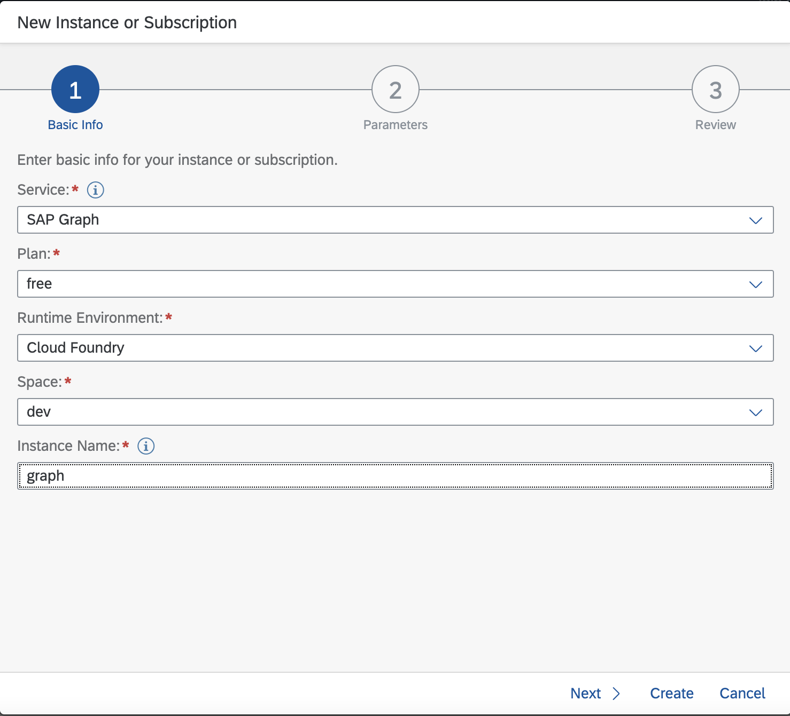
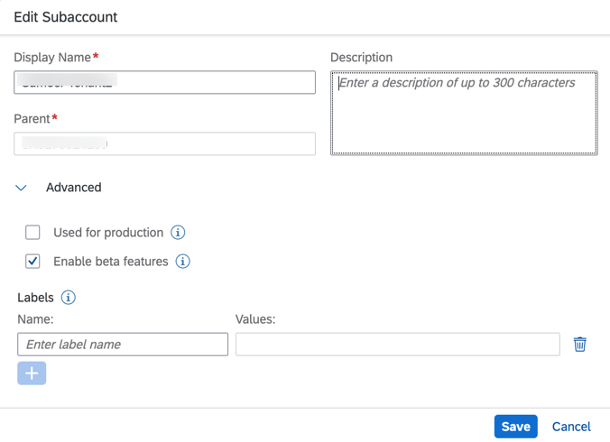

# Set Up SAP Graph

SAP Graph is the easy-to-use API for the data of the SAP Intelligent Enterprise. It offers an API of connected entities from the SAP domain of business processes. As a SAP BTP service, SAP Graph is compatible with SAP Cloud Application Programming (CAP) extension solutions and events managed using SAP Event Mesh.

## Initial Setup

To use SAP Graph in SAP BTP, a service instance needs to be created in the space of your SAP BTP Subaccount.
It requires administrator authorization of SAP BTP.

1. In your SAP BTP subaccount, navigate to **Services** &rarr; **Instances and Subscriptions** in the left-hand pane. A new **Instance or Subscription** wizard opens.

2. Enter the basic information for your instance.

3. Select **SAP Graph** from the dropdown list for **Service**.

4. Select **beta** as **Plan**.

5. Enter a name for your instance.

6. Choose **Create**.



7. Create a new service key for your SAP Graph instance.


8. **Download** the service key file.


9. To configure SAP Graph, a user must have the `SAP_Graph_Key_User` authorization role. To assign this role to a user, you must create a role collection, add the role of `SAP_Graph_Key_User`, and then assign it to the relevant user. See subsection [Create Role Collection and Add Roles](https://help.sap.com/viewer/84bbf6acb5384861add4cb6939bef647/PROD/en-US/d3a155b8842b4a43b1367c2edb1c964e.html) in the SAP Graph documentation for more details.

10. Share the previously downloaded service with the relevant user.

Note:

As SAP Graph is a beta feature, please ensure that beta features are enabled in the subaccount.



## SAP Graph Configuration

The graphctl command line tool is used to configure your SAP Graph tenant. See section [Install graphctl](https://help.sap.com/viewer/84bbf6acb5384861add4cb6939bef647/PROD/en-US/b1b729334aae4021870374237016516e.html) for more details.

1. Install graphctl:

  ```
  npm install -g @sap/graph-toolkit
  ```
  
  > To test is the installation was successful exeecute `graphctl --help` in the command line window. You should see a list of all commands that graphctl supports.

2. To use the tool, you have to log in by using the service key shared by your administrator:

  ```
  graphctl login [-s <service-key.json>]
  ```

3. Generate the configuration file:

  ```
  graphctl generate config [-f <config.jsonc>]
  ```

4. Adapt the configuration if needed. A sample configuration file looks like this. Please ensure that the path field `/sap/opu/odata/sap/API_BUSINESS_PARTNER/` is specified along with the destination (created prior using SAP Extensibility Service) in configuration.

```
{
    "businessDataGraphIdentifier": "v1",
    "graphModelVersion": "1.0.0",
    "dataSources": [
      {
        "name": "s4",
        "services": [
          {
            "destinationName": "<destination_name>",
            "path": "/sap/opu/odata/sap/API_BUSINESS_PARTNER/"
          }
        ]
      }
    ],
    "locatingPolicy": {
      "cues": [],
      "rules": [
        {
          "name": "sap.s4.*",
          "leading": "s4",
          "local": [],
          "mapped": []
        },
        {
          "name": "sap.graph.*",
          "leading": "s4",
          "local": [],
          "mapped": []
        }
      ],
      "description": ""
    }
  }
```

5. Activate the configuration:

  ```
  graphctl activate config -f <config.jsonc> [--force]
  ```

  

See section [Configuration File](https://help.sap.com/viewer/84bbf6acb5384861add4cb6939bef647/PROD/en-US/56a40529c2ef42969dfc94c44e603bde.html) in the SAP Graph documentation for more details.

## Set Up SAP Graph Destination

Maintain the **Graph API** in the URL (for example, `https://xxxx.graph.sap/api/v1`). This is the URL that you received after activation of graph configuration in the previous step. Refer to SAP Graph's service key to fill **Client ID**, **Client Secret**, and **Token Service URL**. Make sure that the token service URL is suffixed with `/oauth/token`.

Use the Graph API to configure the destinations with:

1. *OAuth2JWTBearer* Authentication


2. *OAuth2ClientCredential* Authentication


