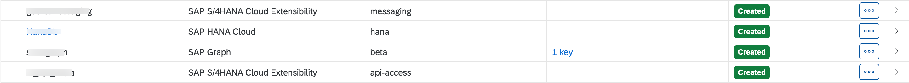
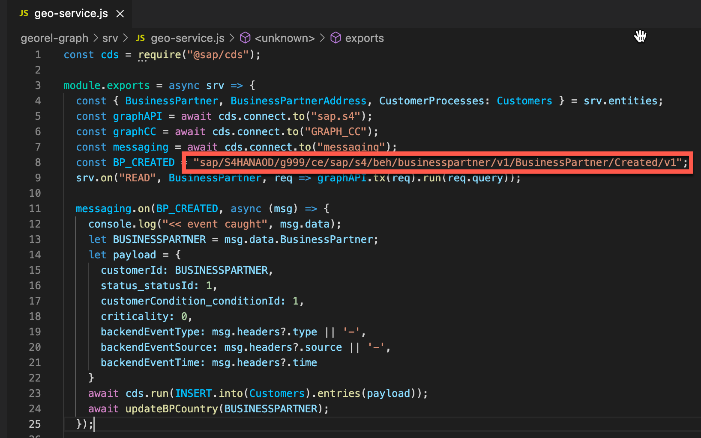
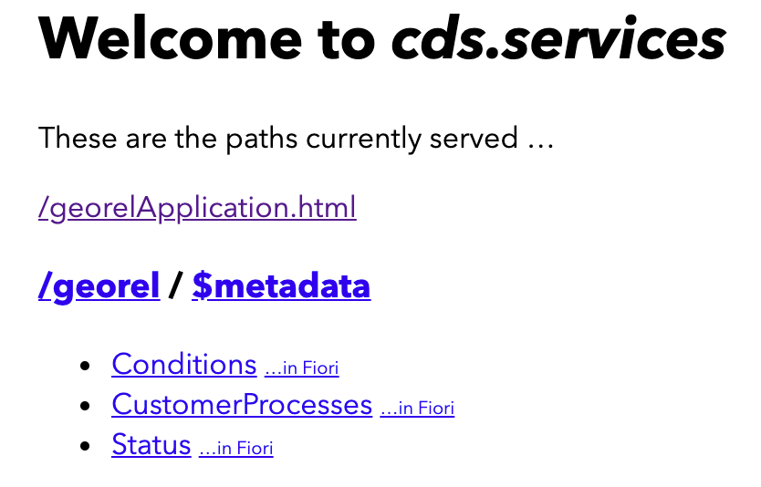
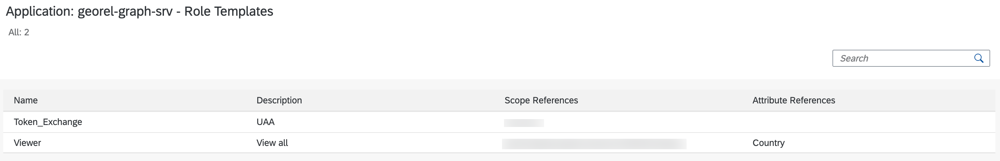
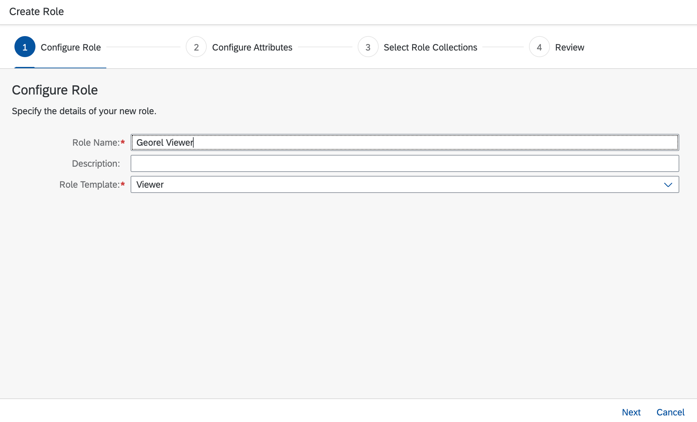
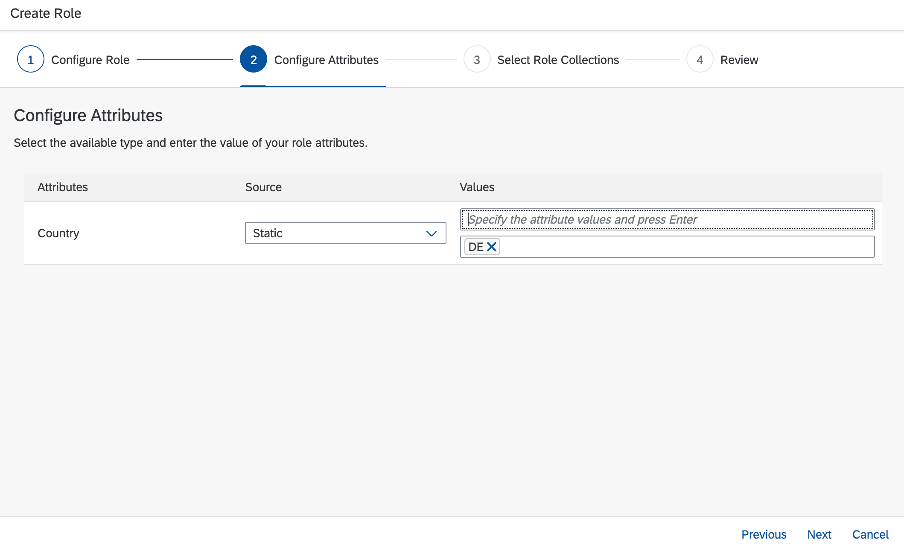
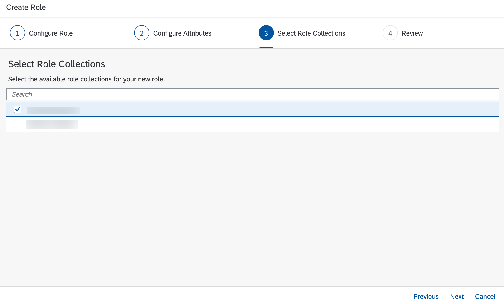

# Configuration

With the app coding ready on your device, you now need to perform a few steps to adjust the app to your own environment.
  
In detail you have to adapt the *manifest.yaml* and the *service.js* files.

1. Find the *manifest.yaml*  and *services-manifest.yml* in your installation folder , open it and perform the below
adjustments, if at all needed. Adjustments are only needed if you have adjusted the services names during the earlier steps or plan for using an app name without the random route option with the push command later on.
    
  In case you are wondering about the correct service names, you can look then up the SAP Business Technology Platform Cockpit.
  
 
  
2. In a next step go to >installation folder< /georel-graph/srv and open the file geo-service.js with the editor of your choice.
  
   
  
- Enter or adapt the constant for *BP_CREATED*. It includes the namespace of the S/4HANA Cloud system plus the four character parameter corresponding to *emClientId*

The namespace of the S/4HANA Cloud system has to be entered. This should be *sap/S4HANAOD/* plus the four character parameter you had picked in step 6 of Setup Connectivity and Extensibility for *emClientId* followed by "ce/sap/s4/beh/businesspartner/v1/BusinessPartner/Created/v1".

Final value should look like this : sap/S4HANAOD/g999/ce/sap/s4/beh/businesspartner/v1/BusinessPartner/Created/v1


# Deployment

We are going to use the cloud foundry command line client for the deployment. In case you have not installed it yet, follow the steps described in this blog:

https://blogs.sap.com/2019/06/11/sap-cloud-platform-backend-service-tutorial-23-using-command-line-for-cloud/

To deploy the application perform the following steps:

1. Open command prompt.
2. Login to the account and space:

```
cf login -sso
```
or alternatively

```
cf login
```

2. Login to the account and space with *cf login*.
3. Navigate to the folder >installation folder</

### Deployment using manifest file
1. Ensure you are in the folder that contains the *manifest.yaml* file.
2. Execute the following command, using [CF service push plugin](https://github.com/dawu415/CF-CLI-Create-Service-Push-Plugin)


```
    cf create-service-push --vars-file vars-dev.yml --push-as-subprocess
```

### Deploy Application (using MTA)

```
mbt build
```

```
cf deploy -f <path/to/mtar>
```

6. Check the console for the final output and that the deployment has worked out.

7. Check and remember the URL of your deployed app.

Example URL: *geo.cfapps.eu10.hana.ondemand.com*

Hint: Using the command ```CF apps``` you can always look up this information

Note: replace “geo” with the host name which was entered in the *manifest.yaml* file.

8. Open the URL of your deployed app in a browser. Click on the hyperlink /georelApplication.html

 


# Create role

After the application is deployed, you will see two role templates.



Now we need to create a new role using role template 'Viewer'.

1. Go to Roles.
2. Add new role("+" icon).
3. Configure role attributes. Choose "Viewer" role template.



4. Click on next.
5. Specify the country attribute of your choice.



6. Click on next.
7. Choose the role collection of your preference.



8. Click on next.
9. Review the role.
10. Click on finish.
11. Please ensure that the chosen role collection is assigned to the application's user.