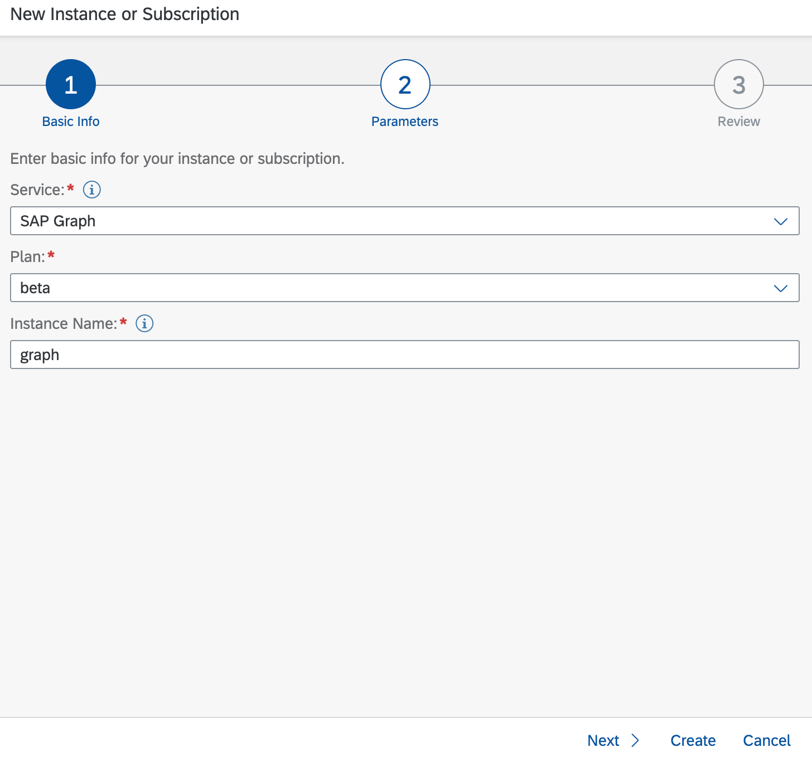
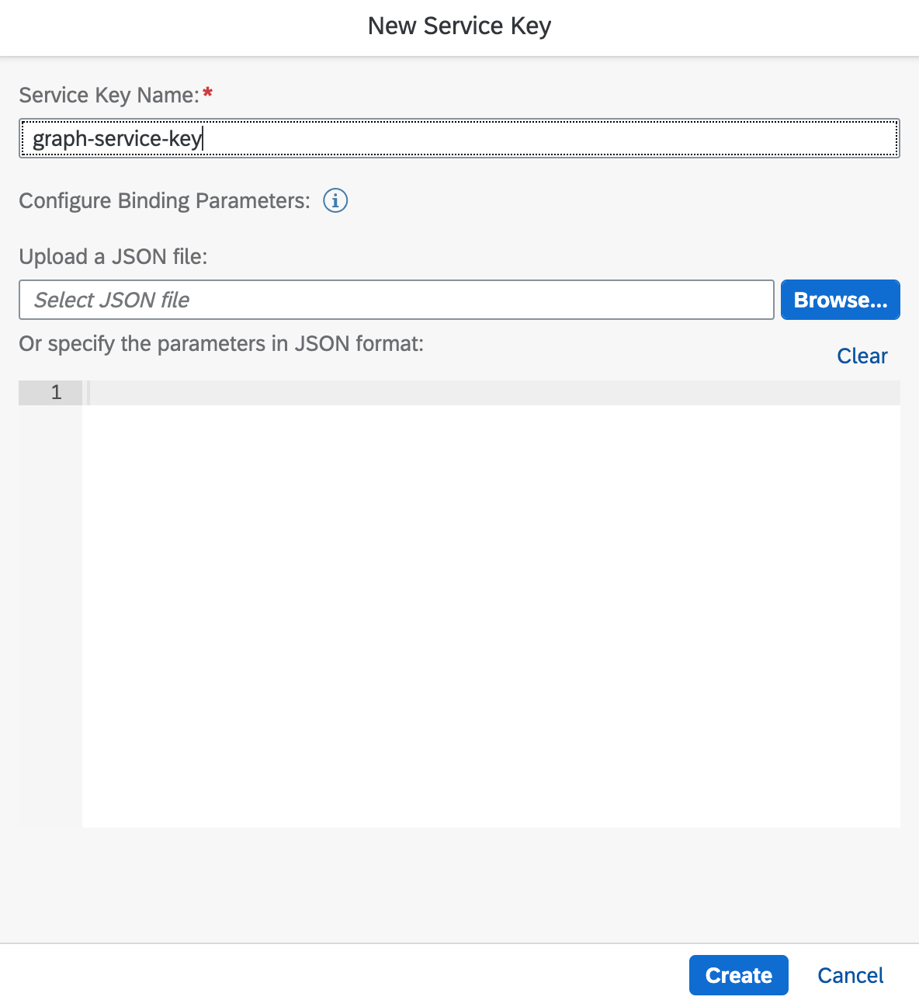
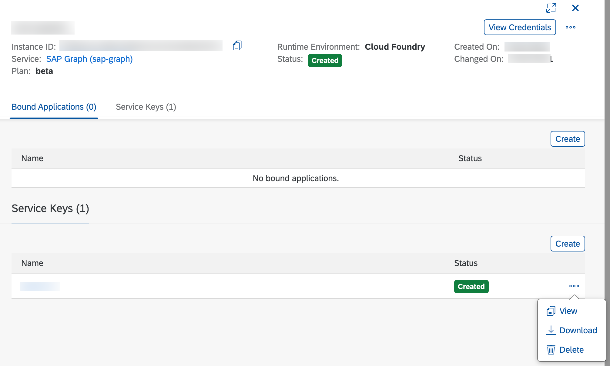
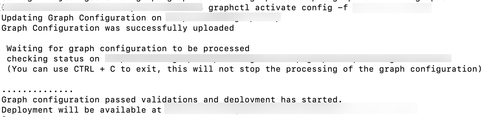
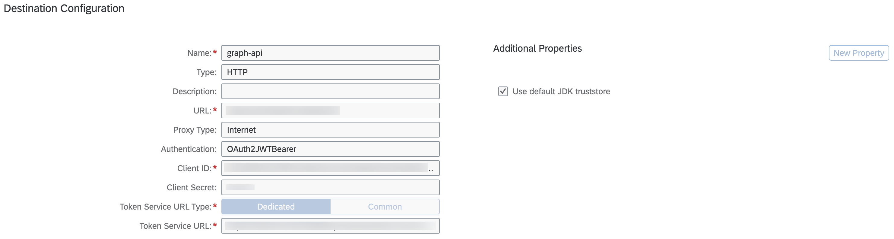
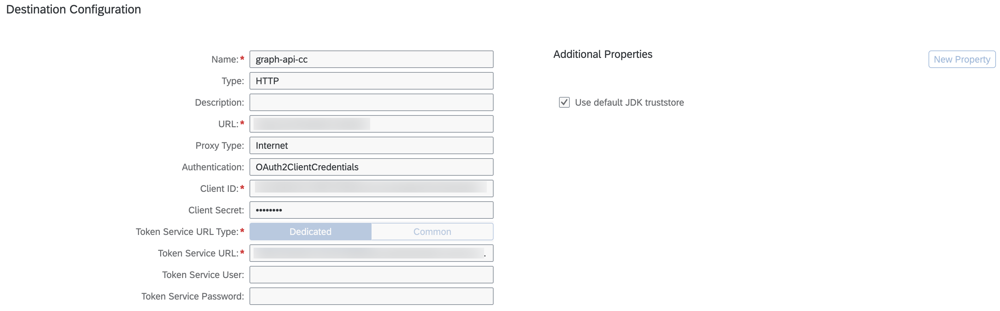

# Setup SAP Graph service 

SAP Graph is the easy-to-use API for the data of the Intelligent Enterprise from SAP. It provides an intuitive programming model that you can use to easily build new extensions and applications using SAP data.

## Initial Setup

In order to use SAP Graph in SAP Business Technology Platform, a service instance needs to be created in desired space of SAP BTP Subaccount.
It requires administrator authorization of the SAP Business Technology Platform.

1. In the SAP BTP cockpit, go to Services Instances and Subscriptions and choose Create in the top-right corner. A New Instance or Subscription wizard opens.

2. Enter the basic info for your instance. Select the SAP Graph Service from the drop-down menu.

3. Select beta for your plan.

4. Enter a name for your instance.

5. Choose Create.



6. Create service key of above SAP Graph instance.



7. Download the service key file.



8. To configure SAP Graph, a user must have the SAP_Graph_Key_User authorization role. To assign this role to a user, you must create a role collection, add the role of SAP_Graph_Key_User, and then assign it to the relevant user.

For detailed instructions, please refer "Create Role Collection and Add Roles" section to below documentation.

https://help.sap.com/viewer/84bbf6acb5384861add4cb6939bef647/Beta/en-US/d3a155b8842b4a43b1367c2edb1c964e.html

9. Please share the previously downloaded service with the relevant user.

## Graph Configuration

1. Install graphctl
    
    ` npm install -g @sap/graph-toolkit `

2. Login to graphctl using the service key shared by your administrator.

    > graphctl login [-s <service-key.json>]

3. Generate the configuration file

    > graphctl generate config [-f <config.jsonc>]

4. Adapt the configuration if needed. Sample configuration file is shown below.

```
{
    "businessDataGraphIdentifier": "v1",
    "graphModelVersion": "1.0.0",
    "dataSources": [
      {
        "name": "s4",
        "services": [
          {
            "destinationName": "xf_api_bupa",
            "path": "/sap/opu/odata/sap/API_BUSINESS_PARTNER/"
          }
        ]
      }
    ],
    "locatingPolicy": {
      "cues": [],
      "rules": [
        {
          "name": "sap.s4.*",
          "leading": "s4",
          "local": [],
          "mapped": []
        },
        {
          "name": "sap.graph.*",
          "leading": "s4",
          "local": [],
          "mapped": []
        }
      ],
      "description": ""
    }
  }
```
  Please do ensure that the path "/sap/opu/odata/sap/API_BUSINESS_PARTNER/" is specified along with the destination(created prior via. SAP Extensibility Service)/

4. Activate the configuration

    > graphctl activate config -f <config.jsonc> [--force] 

For more information, please refer below documentation:

https://help.sap.com/viewer/84bbf6acb5384861add4cb6939bef647/Beta/en-US/56a40529c2ef42969dfc94c44e603bde.html



## Set up Graph Destination

Please use the graph API to configure destinations with:

1. OAuth2JWTBearer Authentication



2. OAuth2ClientCredential Authentication



Please maintain Graph API in URL. Please refer SAP Graph's service key to fill Client ID, Client Secret and Token Service URL. 
